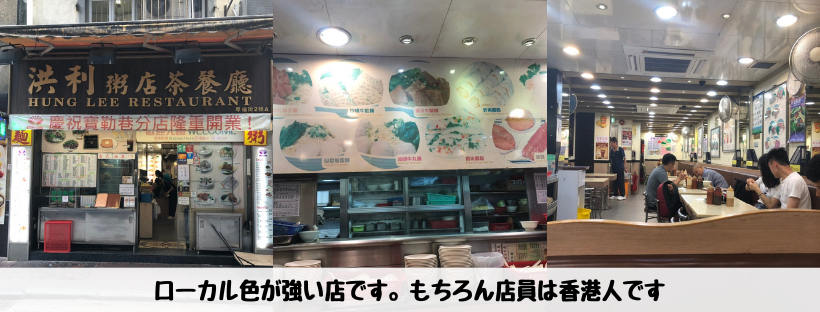
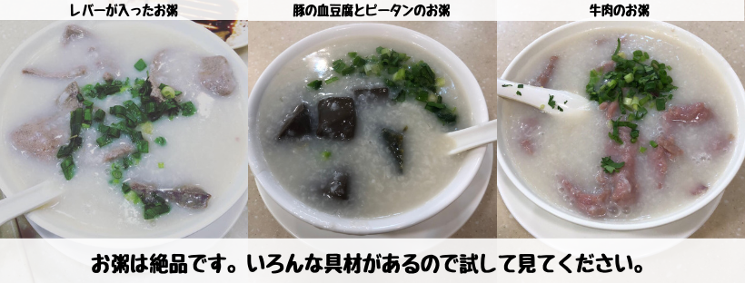
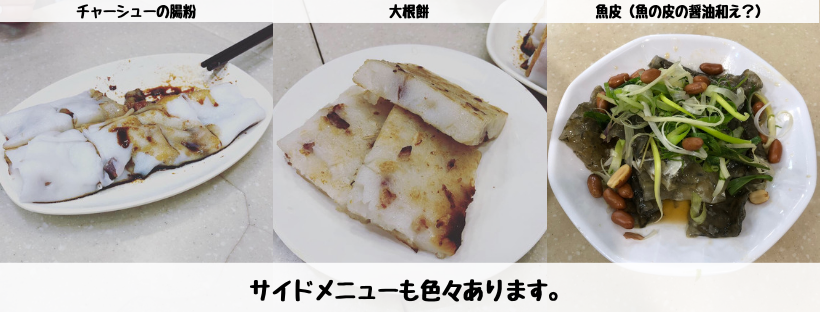

## はじめに

香港生活4年目のなかむ（[@nakanakamu0828](https://twitter.com/nakanakamu0828)）です。  

香港に来たら是非食べて欲しいのが**お粥**です。  
日本だと体調が悪い時に食べるものという認識がありますが、香港のお粥は全然別物です。  
具材によって色々なバリエーションがありますし、出汁でお粥を作っている為しっかりとした味付けがやみ付きになります。

そんなお粥の有名店「**洪利粥店茶餐廳**」に行ってきました。

## 写真（メニュー・店舗）

香港のローカル店っぽい内装です。  
ちょっと小汚く感じる方もいるかもしれませんが、そこが日本のチェーン店とは違う香港に来てこそ体験できるいいところです。  
貴重な体験をして見てください。

お粥絶品ですよ。  
朝からがっつり食べるのが苦手な方はお粥にしましょう！  
また、お昼にさっぱりお粥を食べるのもいいですね！！

個人的には、魚の皮が好きです 笑  
腸粉や大根餅も香港で是非食して欲しい料理です！

## 基本情報

| 項目 | 詳細 |
|:---|:---|
|  **店名**  |  洪利粥店茶餐廳  |
|  **電話番号**  |  (+852) 27216606  |
|  **住所**  |  香港尖沙咀厚福街2號A  |

<iframe src="https://www.google.com/maps/embed?pb=!1m18!1m12!1m3!1d3691.43352164074!2d114.17174121454909!3d22.299438485323975!2m3!1f0!2f0!3f0!3m2!1i1024!2i768!4f13.1!3m3!1m2!1s0x340400ee78fade9f%3A0x90bce4a88ea92837!2sHung+Lee+Restaurant!5e0!3m2!1sja!2shk!4v1558540854809!5m2!1sja!2shk" width="600" height="450" frameborder="0" style="border:0" allowfullscreen></iframe>

## 参考情報
- [洪利粥店茶餐廳,Hung Lee｜香港のグルメ｜ユートラベルノート](http://www.utravelnote.com/hongkong/food/hunglee)
- [Hung Lee （洪利粥店茶餐廳） - 尖沙咀 チムサーチョイ/パン・サンドイッチ（その他） [食べログ]](https://tabelog.com/hongkong/A5201/A520101/52000604/)

## 最後に
いつもお粥が食べたくなってしまい「洪利粥店茶餐廳」では食べないのですが、麺料理も充実しています。  
是非皆さん香港旅行の際にお立ち寄りください！
