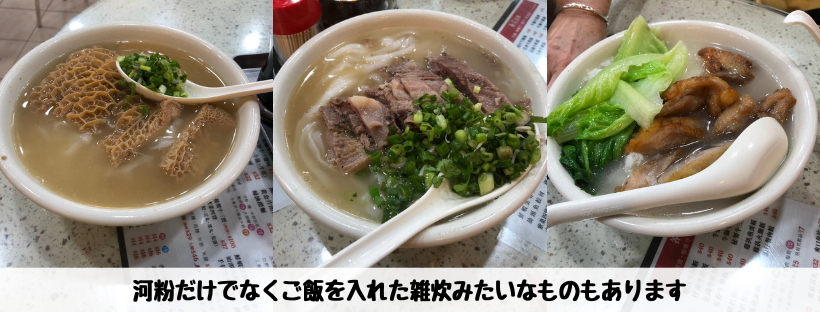
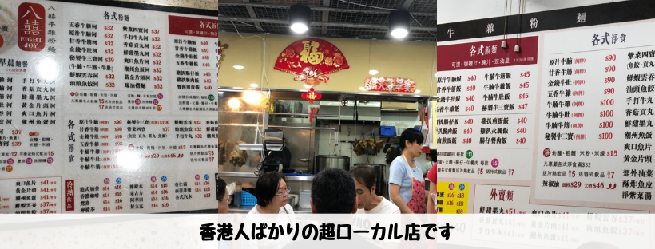

## はじめに

香港生活4年目のなかむ（[@nakanakamu0828](https://twitter.com/nakanakamu0828)）です。  

彩明商場内にある彩明街市で「**河粉**」を食べてきました。  
[河粉](https://ja.wikipedia.org/wiki/%E6%B2%B3%E7%B2%89)とは

> Wikipedia  
> 中国広東と東南アジアの一帯でよくみられる平たいライスヌードルである。

ベトナムのフォーと同じような米で作られている麺です。  
麺料理が豊富な香港ですが、特に河粉が好きで私はよく食べます。

## 写真

河粉以外にも麺やご飯など色々なメニューもあります。  
私は河粉大好きなので、毎回河粉です。  
さっぱりと食べれて美味しいです！！

市場の中にあるお店なので超ローカル店です。  
せっかく来た香港ですし、香港人と同じ目線で生活してみるのもいいと思います。

## 基本情報

| 項目 | 詳細 |
|:---|:---|
|  **店名**  |  彩明商場  |
|  **電話番号**  |  (+852) 39774958  |
|  **住所**  |  新界將軍澳調景嶺彩明街1號彩明商場  |

<iframe src="https://www.google.com/maps/embed?pb=!1m18!1m12!1m3!1d3691.2469566634113!2d114.25016551454925!3d22.306498135320307!2m3!1f0!2f0!3f0!3m2!1i1024!2i768!4f13.1!3m3!1m2!1s0x0%3A0x5a4ad448c8a9f3f4!2sChoi+Ming+Market!5e0!3m2!1sja!2shk!4v1558927654574!5m2!1sja!2shk" width="600" height="450" frameborder="0" style="border:0" allowfullscreen></iframe>

## 参考情報
- [彩明商場](https://www.linkhk.com/tc/shopCentre/chmxc2)

## 最後に
ローカル料理は安くて美味しいものも多いです。  
私は河粉が好きでよく食べますが、他にも色々な料理があります。  
是非ご自身の好きな料理を探してみて下さい。