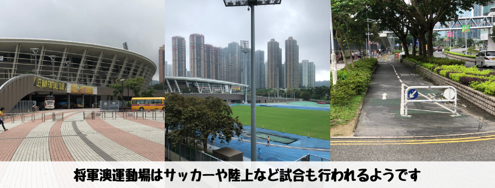
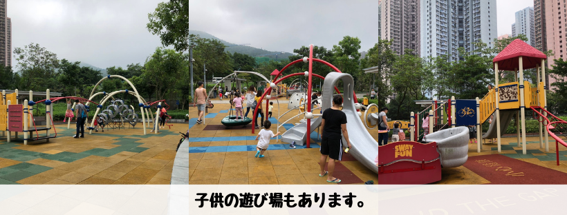
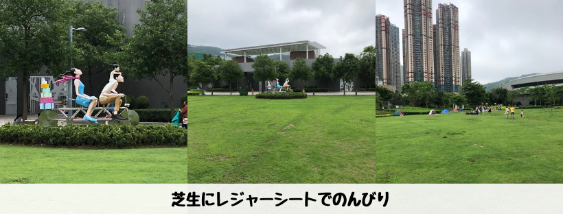

## はじめに

香港生活4年目のなかむ（[@nakanakamu0828](https://twitter.com/nakanakamu0828)）です。  

香港の都心部は人も多く、スピード感があり、慌ただしい感じがあります。休みの日はのんびり公園に出かけるのもいいですね！  
今回は**将軍澳**駅から徒歩15分程の位置にある**将軍澳運動場**に散歩しに行きました。  
近くに香港単車館公園もあり子供達の遊び場も充実しています。  

私のイメージになりますが、香港では土曜日遊びに出かけて、日曜は家族とのんびりする人が多いのではないでしょうか!？  
なので、公園も土曜日より日曜日の方が人が多いです。  
多くの子供達と遊ばせたい時は日曜日に、のんびりしたいときは土曜日に行くのがいいですね。

## 写真

将軍澳運動場の横をよく通るのですが、陸上やラグビーの練習をしている人たちが多いですね！
公園の周りはランニング＆サイクリングコースも用意されているので、一般の方々は散歩よランニングなど運動をしている人も多いです。

香港は公道で自転車に乗ることができません。なので、自転車に乗れない香港人も多いと思います。  
日本人は自転車乗れて当たり前なので、私も娘には自転車に乗れるようになってもらいたいです。  
自転車を貸し出してくれて、練習している香港人も多いです。娘ももう少し大きくなったら自転車の練習をさせたいと思います。

滑り台などアスレチックもあります。子供同士で楽しく遊んでいる姿が微笑ましいですね！

芝生にレジャーシートやテントを用意して、のんびり過ごしている方も多いです。

## 基本情報

| 項目 | 詳細 |
|:---|:---|
|  **店名**  | 将軍澳運動場  |
|  **住所**  |  將軍澳寶康路109號 |
|  **周辺施設** | 單車館停車場, 香港単車館公園 | 

<iframe src="https://www.google.com/maps/embed?pb=!1m18!1m12!1m3!1d3691.103479710659!2d114.26177311454941!3d22.3119258853175!2m3!1f0!2f0!3f0!3m2!1i1024!2i768!4f13.1!3m3!1m2!1s0x3404038b46f27181%3A0x624548b7e33a6325!2z5bCG6LuN5r6z6YGL5YuV5aC0!5e0!3m2!1sja!2shk!4v1558792353949!5m2!1sja!2shk" width="600" height="450" frameborder="0" style="border:0" allowfullscreen></iframe>

## 参考情報
- [康樂及文化事務署 - 運動場](https://www.lcsd.gov.hk/clpss/tc/webApp/Facility/Details.do?ftid=38&did=8)

## 最後に
平日仕事ばかりで運動不足になりがちです。子供と一緒に遊んだり、運動したり、子供とのんびり公園で過ごすのもいいですね！