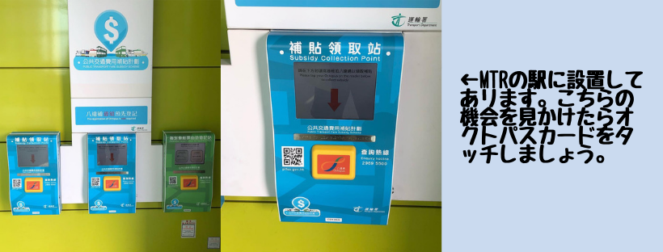

## はじめに

香港生活4年目のなかむ（[@nakanakamu0828](https://twitter.com/nakanakamu0828)）です。  

先日紹介した「**オクトパスカード**」ですが、公共交通機関の利用料金が還付されます。  
益々**オクトパスカード**は便利になりますね。

## どのくらい還付されるの？

> 公共交通機関で月額400香港ドル以上を利用した場合、最大で300香港ドルを還付する制度の運用を始めた。  
> 引用: [香港の公共交通機関で割引制度開始　最大で300香港ドル還付](https://hongkong.keizai.biz/headline/1056/)  

駅にいた係員さんに話を伺ったところ、１ヶ月の区切りは15日締めの16日始めりということでした。  
毎月16日以降にタッチしましょう。

## 写真

## 参考情報
- [香港の公共交通機関で割引制度開始　最大で300香港ドル還付](https://hongkong.keizai.biz/headline/1056/)  

## 最後に
皆さんも還付の有無に関わらずタッチする癖をつけましょう。