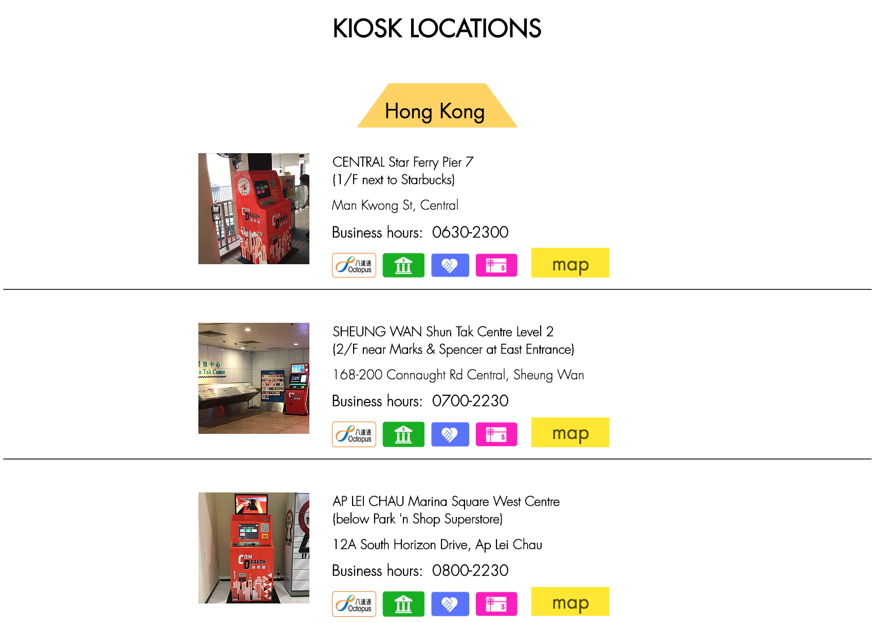
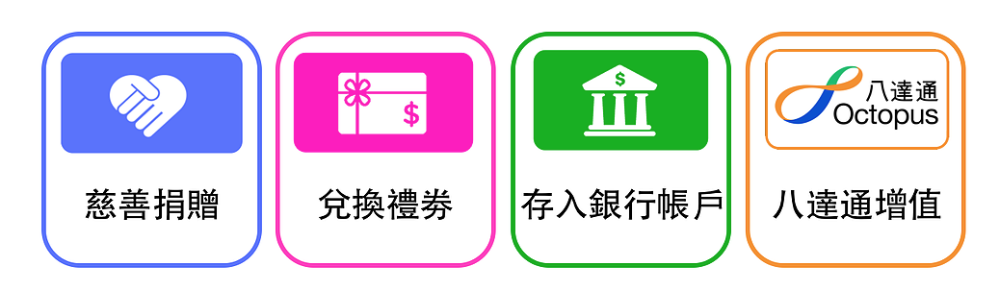
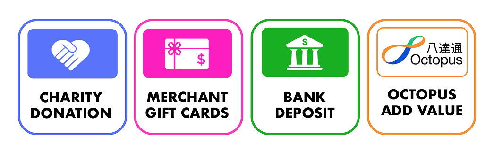

## はじめに

香港生活4年目のなかむ（[@nakanakamu0828](https://twitter.com/nakanakamu0828)）です。  

香港在住の皆さんは香港ドルの硬貨が溜まっていたりしませんか？
今回は硬貨を「**オクトパスカード**」にチャージすることができる「**COIN DRAGON**」を紹介します。
私は貯金箱で小銭貯金をしています。市場やスーパーなどでセントが返ってきたときなど使い道に困っていて、いつの間にか貯金するようになりました。

そんな貯金を**COIN DRAGON**でチャージしてきました。

※ ATMのような機械が設定されていて、そこからチャージすることが可能です。

## どこに機械が設置されてるの？

2019/05/29時点では、香港内に38台設置されているようです。  
[COIN DRAGON - 公式サイト](https://www.coindragon.co/location-en)から設置場所が確認できます。  
詳細はこちらをご確認ください。

## 注意点
**10%の手数料** がかかります。  
利用してはじめて気づきました！「え！？手数料あんの？ 10%高くね！！」ってなりました。
手数料だけご注意ください。

## オクトパスカード以外へのチャージについて

- **募金**
- **ギフトカード交換**
- **銀行振込**
- **オクトパスカードへのチャージ**

の４種類があるようです。**銀行振込**と**オクトパスカードへのチャージ**が10％の手数料がかかります。

## 利用方法
英語や広東語ですが、動画を見て頂くと利用方法がわかります。  
参考にしてくださいませ！

`youtube: https://www.youtube.com/watch?v=AhMNfdy2Fc8`  
`youtube: https://www.youtube.com/watch?v=U5DBux-_u68`  

## 参考情報
- [COIN DRAGON - 公式サイト](https://www.coindragon.co/)  

## 最後に
皆さんも硬貨をチャージしてみてください！