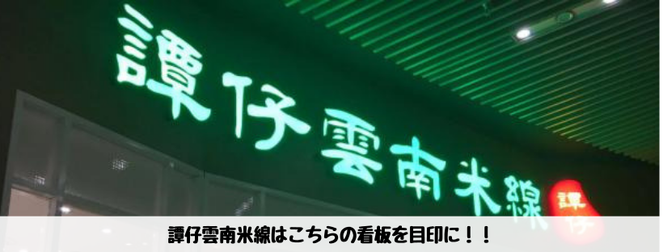
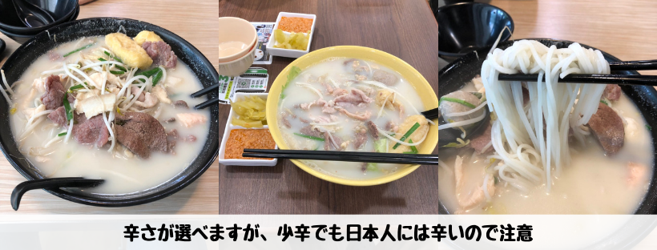

## はじめに

香港生活4年目のなかむ（[@nakanakamu0828](https://twitter.com/nakanakamu0828)）です。  

彩明商場内にある**譚仔雲南米線**で「**米線**」を食べてきました。  
先日紹介した**河粉**と同じで**米線**もライスヌードルです。  
**河粉**の記事は以下をご確認ください。

<embed-post-card href="/2019/05/25/ho-fun/"></embed-post-card>

## 写真

**譚仔雲南米線**はチェーン店です。  
香港の色々なところで見かけますので、是非見つけたら食べてみてください。  
店舗情報がどこにも見つからない・・・

辛さが色々選べます。少辛でも日本人には辛いので注意が必要です。  
私はサイドメニューはまだ食べたことがないのですが、豊富に用意されています。  
是非、米線と一緒に召し上がってください。

## 基本情報

| 項目 | 詳細 |
|:---|:---|
|  **店名**  |  彩明商場  |
|  **電話番号**  |  (+852) 26188766  |
|  **住所**  |  新界將軍澳調景嶺彩明街1號彩明商場2樓251-252號铺  |
|  **サイト**  |  http://www.jointedheart.com/ |

<iframe src="https://www.google.com/maps/embed?pb=!1m18!1m12!1m3!1d3691.2467055696834!2d114.25027441454931!3d22.306507635320322!2m3!1f0!2f0!3f0!3m2!1i1024!2i768!4f13.1!3m3!1m2!1s0x0%3A0xcc90f81bedae6993!2sChoi+Ming+Shopping+Centre!5e0!3m2!1sja!2shk!4v1559473939553!5m2!1sja!2shk" width="600" height="450" frameborder="0" style="border:0" allowfullscreen></iframe>

## 参考情報
- [譚仔雲南米線](https://www.openrice.com/zh/hongkong/r-%E8%AD%9A%E4%BB%94%E9%9B%B2%E5%8D%97%E7%B1%B3%E7%B7%9A-%E5%B0%87%E8%BB%8D%E6%BE%B3-%E6%BB%87%E8%8F%9C-%E9%9B%B2%E5%8D%97-%E7%B2%89%E9%BA%B5-%E7%B1%B3%E7%B7%9A-r494725)
- [唔再撈亂譚仔與譚仔三哥！一次睇清譚仔5大分別 | 港生活 - 尋找香港好去處](https://hk.ulifestyle.com.hk/topic/detail/204897/%E5%94%94%E5%86%8D%E6%92%88%E4%BA%82%E8%AD%9A%E4%BB%94%E8%88%87%E8%AD%9A%E4%BB%94%E4%B8%89%E5%93%A5-%E4%B8%80%E6%AC%A1%E7%9D%87%E6%B8%85%E8%AD%9A%E4%BB%945%E5%A4%A7%E5%88%86%E5%88%A5/1)

## 最後に
河粉が飽きたら次は**米線**は如何ですか？
麺料理は本当に美味しいものが多いです。香港に来たら是非食してみてください。
