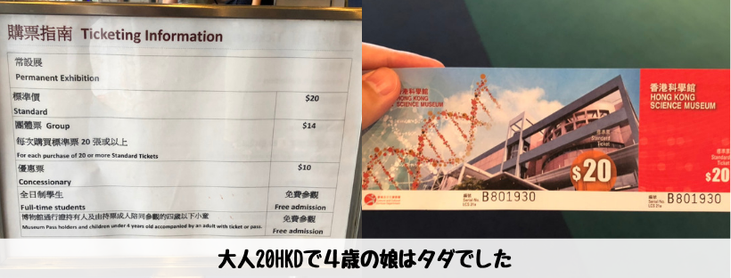
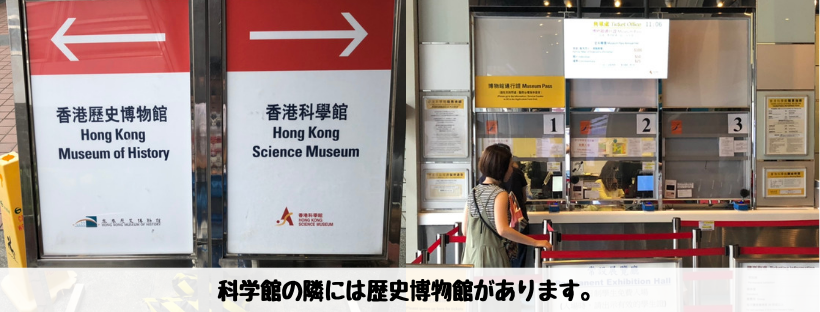
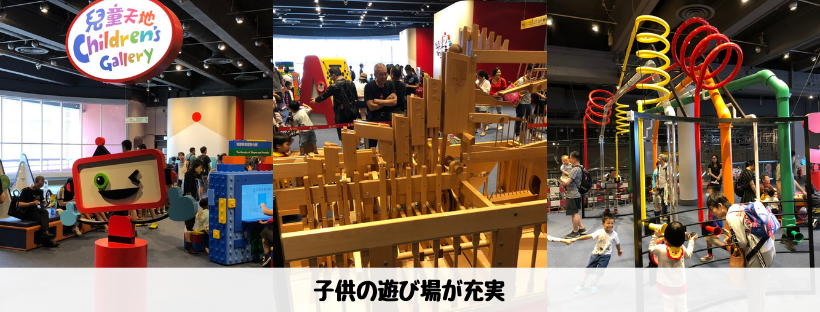
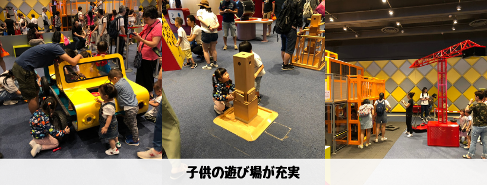
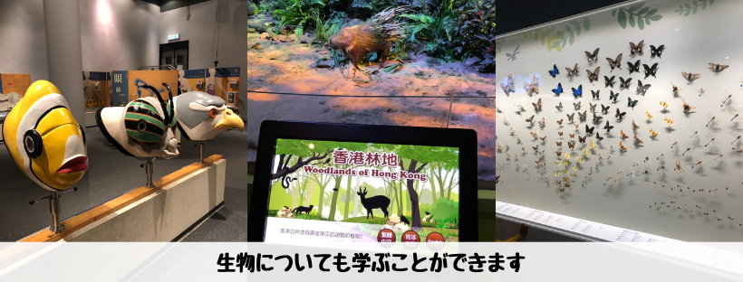
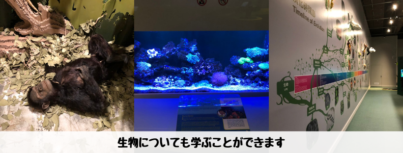
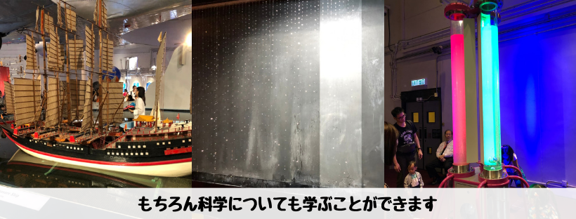
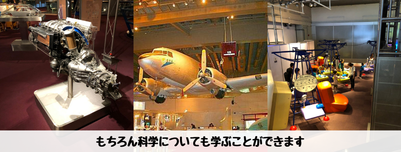

## はじめに

香港生活4年目のなかむ（[@nakanakamu0828](https://twitter.com/nakanakamu0828)）です。  

今回は、**尖東**にある「**香港科學館**」に遊びに行ってきました。  
子供の遊び場も充実していて、家族連れが多い場所です。  
科學館と記載はありますが、科学だけでなく生物だったり他のカテゴリーも存在するので十分楽しめます。

## 写真

香港科學館は有料です。ただ、大人20HKDですし、４歳以下の子供は無料です。  
家族連れには安い金額で十分楽しめます。

香港科學館の隣には香港歴史博物館もあります。  
歴史博物館は一度も行ったことがないので、今後行ってみたいと思います。

子供の遊び場がとても充実しています。  
お絵描きしたり、イベントもあるので、英語・広東語がわかる方は是非チャレンジしてみてください。

子供と一緒に生物も学べます。

電気や光の仕組みなど科学も学べます。

## 基本情報

| 項目 | 詳細 |
|:---|:---|
|  **店名**  |  香港科學館  |
|  **電話番号**  |  (+852) 27323232  |
|  **住所**  |  九龍尖沙咀東部科學館道二號 |
|  **営業時間**  |  13：00-21：00（月-水、金）10：00-21：00（土、日、祝日）12月24日、旧正月の大みそかは17：00まで。 |
|  **サイト**  |  https://hk.science.museum/ |

<iframe src="https://www.google.com/maps/embed?pb=!1m18!1m12!1m3!1d6944.363988365527!2d114.17224059325865!3d22.299954626190083!2m3!1f0!2f0!3f0!3m2!1i1024!2i768!4f13.1!3m3!1m2!1s0x0%3A0xcf151869ff222404!2z6aaZ5riv56eR5a2m6aSo!5e0!3m2!1sja!2shk!4v1559580008211!5m2!1sja!2shk" width="600" height="450" frameborder="0" style="border:0" allowfullscreen></iframe>

## 参考情報
- [香港科學館](https://hk.science.museum/zh_TW/web/scm/index.html)
- [香港科学館[Hong Kong Science Museum] | 香港ナビ](https://www.hongkongnavi.com/miru/205/)

## 最後に
子供達の勉強にもなりますし、遊び場もあり、家族で楽しめる場所です。  
そんな**香港科學館**に是非行ってみてください。