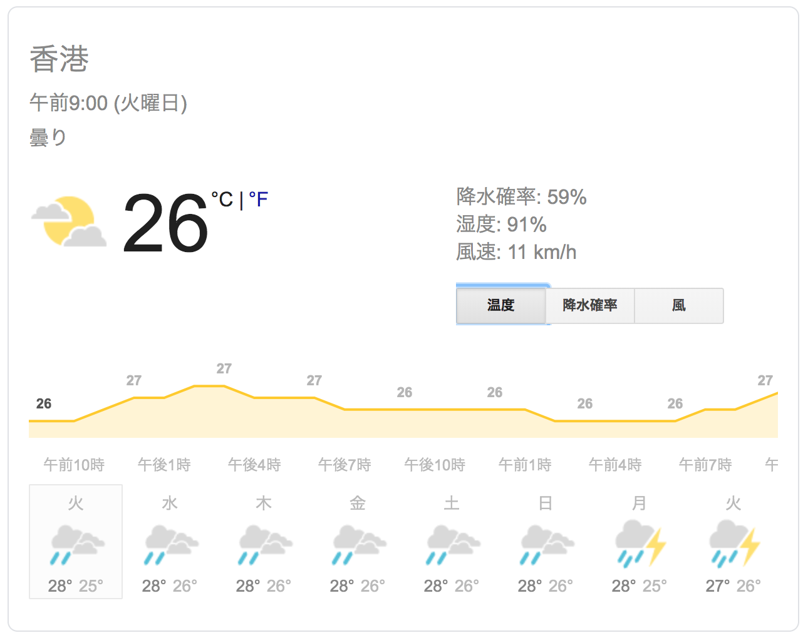

## はじめに

香港生活4年目のなかむ（[@nakanakamu0828](https://twitter.com/nakanakamu0828)）です。  

香港は今日も朝から雷雨でした。尖沙咀は現在止んでますが最近ずっと天気が悪いです。
憂鬱な日々を皆さんはどうお過ごしでしょうか？

## 雨が多い香港で困ること
雨が多い香港ですが、湿度も100%近いです。
現在の天気をGoogle先生に教えてもらいました。

湿度91%ですね。  
香港は多湿のおかげで洗濯物が全然乾きません。部屋にカビも生えやすいです。  
私の家では、エアコンや乾燥機を使って部屋干しでなんとか洗濯物を乾かしています。  
先日記事にした**洗衣店**も便利ですね。

<embed-post-card href="/2019/06/01/cleaning/"></embed-post-card>

## 雨が多いけど便利だと思うこと
香港は駅とマンション、ショッピングモールが地下道や歩道で外に出ないで繋がっているところも多いです。  
私は外に出ないでMTRの地下鉄駅にいけますし、会社へ行くのもほぼ外に出ずに行くことが可能です。  

雨が多い、人が多い、香港では移動が便利で住んでいる人たちに優しいですね。

## 最後に
早くスッキリ晴れないかなーっと思っています。  
もう気温は30度を超えていますし、晴れた日には海で遊びたいですね！！