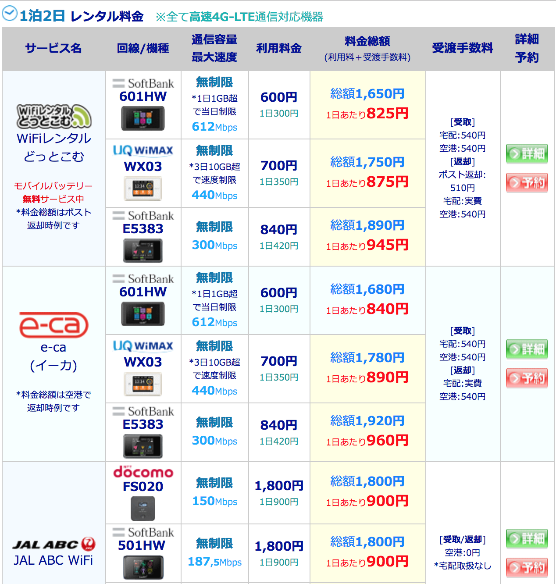
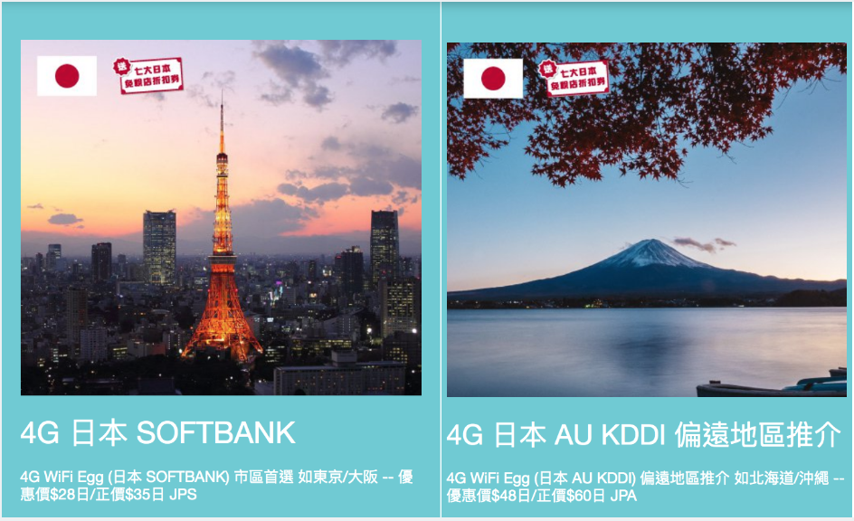
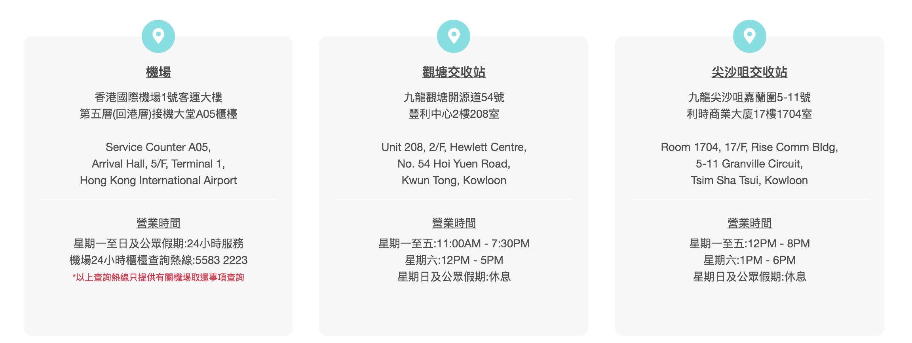

## はじめに

香港生活4年目のなかむ（[@nakanakamu0828](https://twitter.com/nakanakamu0828)）です。  

香港在住の方は、日本帰国時にWiFiをどうしてされてますか？  
もうネットなしでは生きられない世の中になりました。多くの方は、SIMを購入したり・WiFiを契約するのではないでしょうか？  
今回は私がいつも利用している「**爽WiFi**」を紹介します。

## 爽WiFiをなんで使っているの？
安いと紹介されて「**爽WiFi**」を利用することにしました。  
以下が日本の空港で借りることができるWifiです。  

※ [日本国内Wi-Fiレンタルおすすめ比較・格安予約｜海外携帯比較ナビ](https://www.mobistar.jp/wifi-domestic.htm)を参照

手数料含め1日**800円以上**するというのは**高い**と思うわけです。

## 爽WiFiの日本用WiFiは？
日本のWifiは**SoftBank**と**AU（KDDI）**の２種類が用意されています。

- **SoftBank**  
  1日**35HKD（今のレートで500円くらい）**です。東京から大阪で利用できるようですね。詳細にどこまでの地域が対応されているのかわかりませんが、長野までは問題なく使えました。私は帰国時は東京周辺にいることが多いのでいつも安いSoftBankのWifiを利用しています。

- **AU（KDDI）**  
  1日**60HKD（今のレートで840円くらい）**です。北海道から沖縄まで日本全地域で利用できるようです。香港は石垣島に直接行ける便もあります。今度SoftBankの対応範囲外の地域に行くときに利用してみたいと思います。

## どこでWiFiを受け取るの？
以下の３箇所で受け取ることが可能です。私はいつも空港です！

- **機場（香港国際空港）**  
  香港國際機場1號客運大樓  
  第五層(回港層)接機大堂A05櫃檯  

<iframe src="https://www.google.com/maps/embed?pb=!1m14!1m8!1m3!1d922.7557407047487!2d113.9338731!3d22.3149713!3m2!1i1024!2i768!4f13.1!3m3!1m2!1s0x3403e2e7f7fb14ab%3A0x3af0d9233ef0820e!2z44K_44O844Of44OK44Or77yRIDEgU2t5IFBsYXphIFJkLCBDaGVrIExhcCBLb2s!5e0!3m2!1sja!2shk!4v1559747623805!5m2!1sja!2shk" width="600" height="450" frameborder="0" style="border:0" allowfullscreen></iframe>

- **觀塘交收站**  
  九龍觀塘開源道54號  
  豐利中心2樓208室  

<iframe src="https://www.google.com/maps/embed?pb=!1m18!1m12!1m3!1d1845.5832986174435!2d114.22300225806752!3d22.309538296329706!2m3!1f0!2f0!3f0!3m2!1i1024!2i768!4f13.1!3m3!1m2!1s0x34040145a7da2119%3A0xc76dc5bb4b66d130!2s54+Hoi+Yuen+Rd%2C+Kwun+Tong!5e0!3m2!1sja!2shk!4v1559747781538!5m2!1sja!2shk" width="600" height="450" frameborder="0" style="border:0" allowfullscreen></iframe>

- **尖沙咀交收站**  
  九龍尖沙咀嘉蘭圍5-11號  
  利時商業大廈17樓1704室  

<iframe src="https://www.google.com/maps/embed?pb=!1m18!1m12!1m3!1d3691.42001671126!2d114.17300481495475!3d22.299949585323816!2m3!1f0!2f0!3f0!3m2!1i1024!2i768!4f13.1!3m3!1m2!1s0x340400eef4dd299d%3A0xcb00b0a7cf515d48!2sRise+Commercial+Building%2C+5-11+Granville+Circuit%2C+Tsim+Sha+Tsui!5e0!3m2!1sja!2shk!4v1559747873618!5m2!1sja!2shk" width="600" height="450" frameborder="0" style="border:0" allowfullscreen></iframe>

[こちらの問い合わせ](https://www.songwifi.com.hk/contact-us)ページも確認ください。

※ 郵送による受け取りもできるようですが、プラスでお金かかりますしおすすめしません

## 参考情報
- [SONGWIFI 爽WiFi](https://www.songwifi.com.hk/)

## 最後に
皆さんも是非**爽WiFi**を試してみてください！！