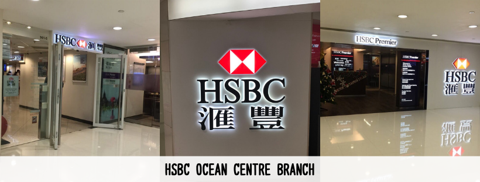
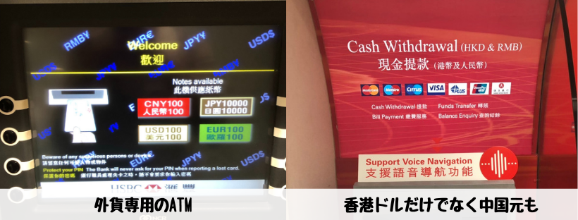

## はじめに

香港生活4年目のなかむ（[@nakanakamu0828](https://twitter.com/nakanakamu0828)）です。  

深圳に出かける為、**中国元（RMB）**が必要になりました。  
香港ではマルチカレンシー口座（複数の通貨で預金できる口座）が一般的です。私は**HSBC（匯豐銀行）**を利用していますので、HSBCのATMから中国元を出金してきました。  
HSBCのATMでは香港ドル以外の通貨も出金できるATMがあります。  

今回は、ハーバーシティーというショッピングモール内のオーシャンセンター支店に行ってきました。

## オーシャンセンター支店情報

| 項目 | 詳細 |
|:---|:---|
|  **企業**  | HSBC（匯豐銀行） |
|  **支店**  | Ocean Centre Branch |
|  **住所**  | 海港城 廣東道5號 3樓361-5號舖 海洋中心 |
|  **電話番号**  | (+852) 22333000 |
|  **営業時間**  | 月～木 09:00-16:30 / 金 09:00-17:00 / 土 09:00-13:00 休業日：　日曜および公休日  |
|  **サイト**  | https://www.hsbc.com.hk/ |

<iframe src="https://www.google.com/maps/embed?pb=!1m18!1m12!1m3!1d14765.675580647312!2d114.15582564721852!3d22.299992030355728!2m3!1f0!2f0!3f0!3m2!1i1024!2i768!4f13.1!3m3!1m2!1s0x0%3A0xca9bb9aeb9e52b54!2z5Yyv6LGQ6YqA6KGM!5e0!3m2!1sja!2shk!4v1560224757130!5m2!1sja!2shk" width="600" height="450" frameborder="0" style="border:0" allowfullscreen></iframe>

## 出金できる通貨は？

もちろん**香港ドル**は出金できるのですが、他にも外貨として以下の通貨が出金できます

- **中国元（RMB）**
- **日本円（JPY）**
- **米ドル（USD）**
- **ユーロ（EUR）**

日本円が出金できるのは日本人にとっては嬉しいですね。

## 参考情報
- [HSBC](https://www.hsbc.com.hk/)

## 最後に
外貨が直接出金できるのは嬉しいですね。香港ドルを出金して一々中国元や日本円に換金するのは手間です・・・  
香港住まいの方は、近くの銀行で外貨が出金できるか確認してみましょう。