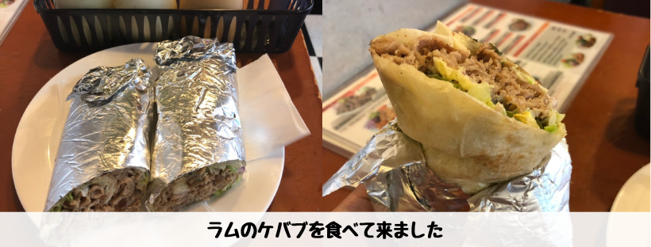
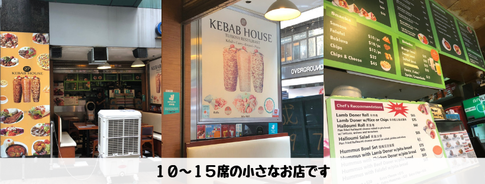
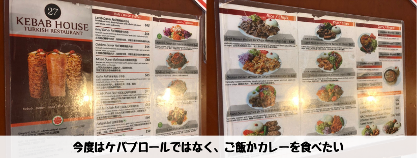

## はじめに

香港生活4年目のなかむ（[@nakanakamu0828](https://twitter.com/nakanakamu0828)）です。  

最近中華がばかり食べているので、久しぶりに「**ケバブ**」を食べにいきました。  
結論からいうと・・・  

**行こうと思ってた店とは別の店に入ってしまいました**  

本当は[Ebeneezer's Kebabs & Pizzeria](https://www.openrice.com/en/hongkong/r-ebeneezers-kebabs-pizzeria-tsim-sha-tsui-middle-eastern-salad-r15719) に行きたかったのですが、探してる途中に**ケバブ**の看板が見えたので入ってしまいました。

今回行ってきたお店は、[27 Kebab House](https://www.openrice.com/zh/hongkong/r-27-kebab-house-turkish-restaurant-%E5%B0%96%E6%B2%99%E5%92%80-%E5%9C%9F%E8%80%B3%E5%85%B6%E8%8F%9C-%E6%B2%99%E5%BE%8B-r174912)です。

## 写真

ラムは癖が強いですが好きな人にはたまらない味です！  
牛の方が安いのでラムの匂いや癖が苦手な方は是非牛を！！  

すごく小さなお店です。工事してて看板がなく**なんていうお店なんだ！？**って最初は思いました。

最初にメニューを見たときはラムカレーが食べたかったんですよね。  
でも、ケバブ食べに来てカレーは・・・  
次回はご飯ものかカレーにしたいと思います。

## 基本情報

| 項目 | 詳細 |
|:---|:---|
|  **店名**  |  27 Kebab House  |
|  **住所**  | 尖沙咀亞士厘道 18 號地下 |

<iframe src="https://www.google.com/maps/embed?pb=!1m18!1m12!1m3!1d7727.623236576109!2d114.16764709061276!3d22.29844886723268!2m3!1f0!2f0!3f0!3m2!1i1024!2i768!4f13.1!3m3!1m2!1s0x340400f27d81a62b%3A0x25145ed40609239c!2s27+Kebab+House!5e0!3m2!1sja!2shk!4v1559836570275!5m2!1sja!2shk" width="600" height="450" frameborder="0" style="border:0" allowfullscreen></iframe>

ちなみに、Centralにも別の店舗があるようです。チェーン店なんですねー

## 参考情報
- [27 Kebab House](https://www.openrice.com/zh/hongkong/r-27-kebab-house-turkish-restaurant-%E5%B0%96%E6%B2%99%E5%92%80-%E5%9C%9F%E8%80%B3%E5%85%B6%E8%8F%9C-%E6%B2%99%E5%BE%8B-r174912)

## 最後に
中華以外が食べたくなったら**ケバブ**はいかがでしょうか？