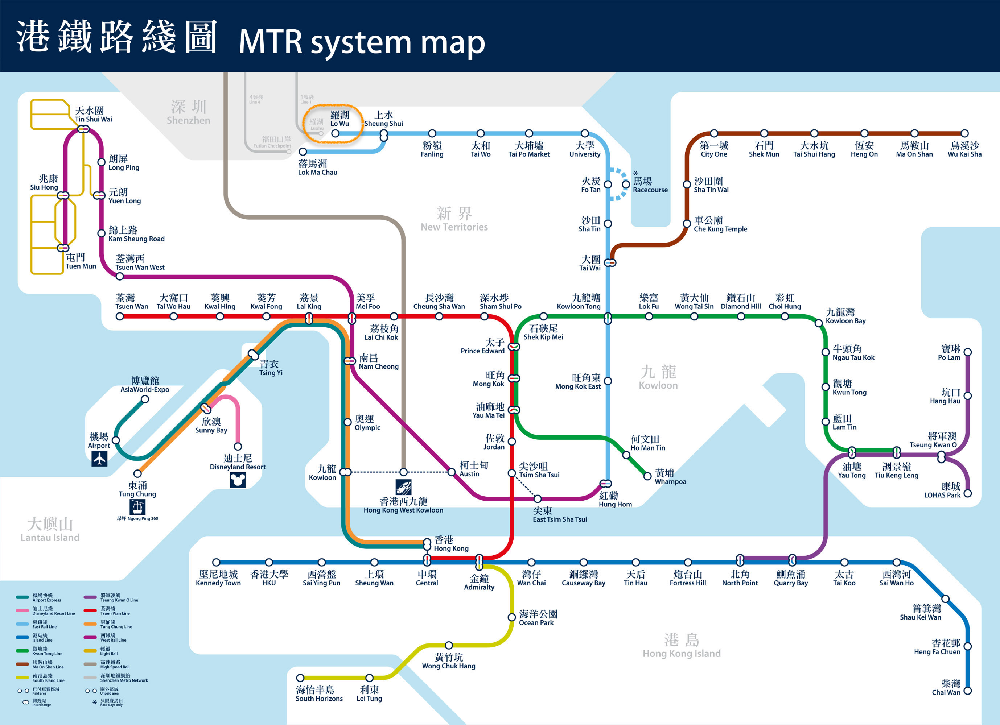
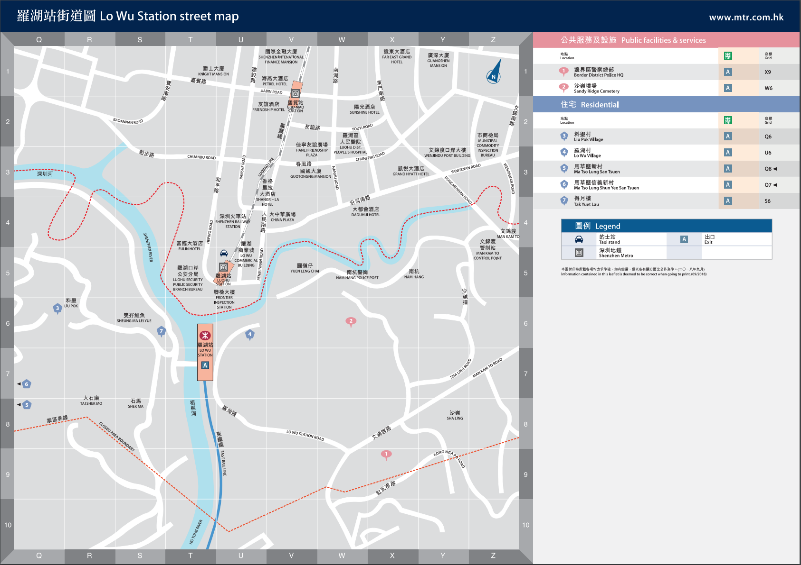
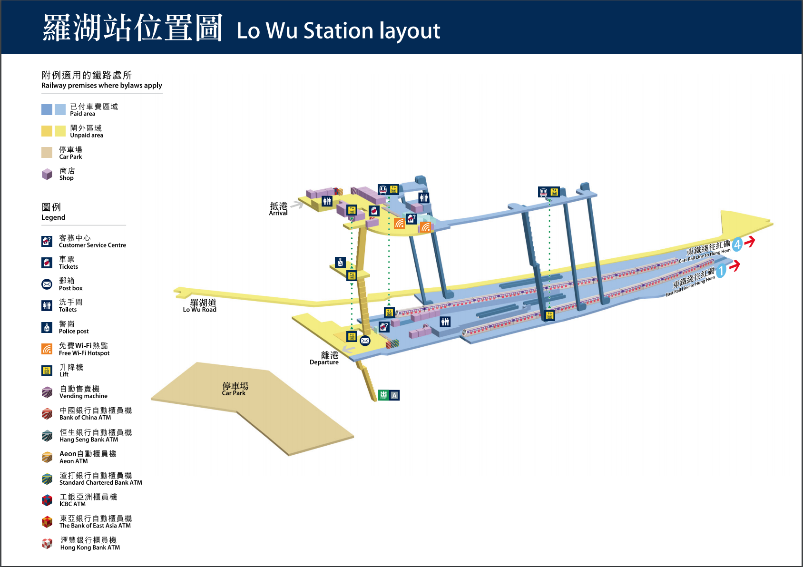
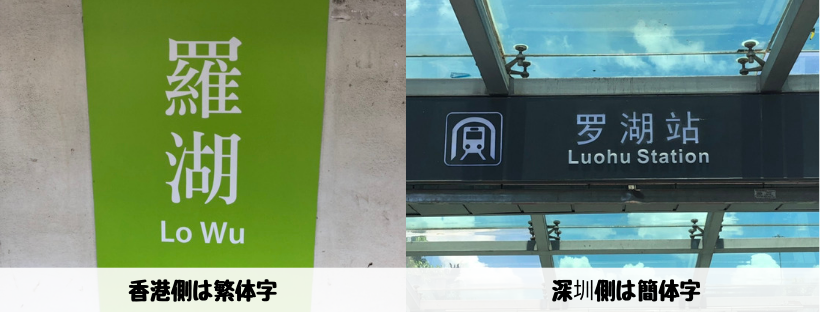
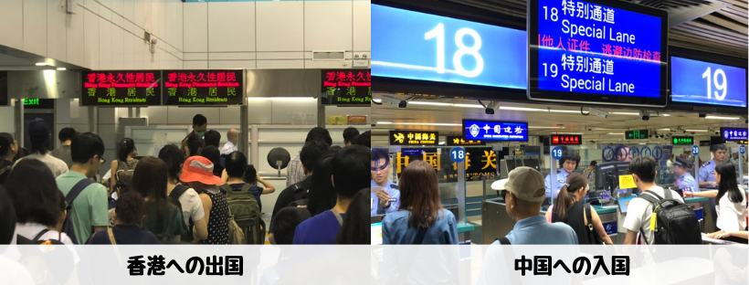
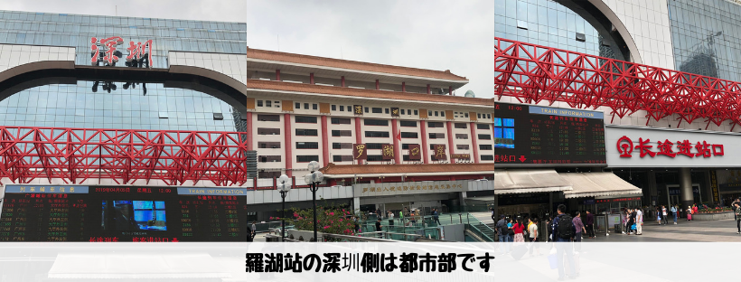
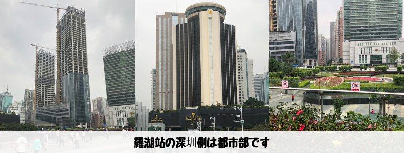

## はじめに

香港生活4年目のなかむ（[@nakanakamu0828](https://twitter.com/nakanakamu0828)）です。  

深圳に出かけてきました。今回は「**羅湖**」から中国に入国したので**羅湖**の紹介をします。

## 羅湖駅について

左上の深圳と接している「**羅湖**」という場所です。  
東鐵綫（水色の線）を利用して紅磡から行くことができます。

羅湖はイミグレーション（出入国管理局）に直結していて外に出ることはできません。  
要するに**深圳**との出入国しかできません。

画像については、[MTR - SYSTEM MAP](http://www.mtr.com.hk/en/customer/services/system_map.html)を引用

## 写真

香港側は**繁体字**、中国側（深圳）は**簡体字**を利用している為、漢字が異なります。

香港 → 中国に向かう場合、香港の出国手続きと中国への入国手続きが必要になります。  
同じ国なのに不思議ですね。

香港側は中国に近くにつれて山が増え田舎になりますが、一歩中国（深圳）に入ると都市部になります。  
そして広い中国の一部ということもあり、道が広かったり印象がガラッと変わります。

## 基本情報

| 項目 | 詳細 |
|:---|:---|
|  **場所**  | 羅湖站 |
|  **住所**  | 1168 Renmin S Rd, Lo Wu, 中国 |

<iframe src="https://www.google.com/maps/embed?pb=!1m18!1m12!1m3!1d3685.304976435326!2d114.11758101455402!3d22.53024558520463!2m3!1f0!2f0!3f0!3m2!1i1024!2i768!4f13.1!3m3!1m2!1s0x3403f5c2a2500c39%3A0xe6695ebf04a174c7!2z576F5rmW6aeF!5e0!3m2!1sja!2shk!4v1560146052997!5m2!1sja!2shk" width="600" height="450" frameborder="0" style="border:0" allowfullscreen></iframe>

## 参考情報
- [MTR - SYSTEM MAP](http://www.mtr.com.hk/en/customer/services/system_map.html)

## 最後に
皆さんも香港から深圳に遊びに行ってみてはどうでしょうか？  
別途記事で深圳の観光スポットを紹介したいと思います。