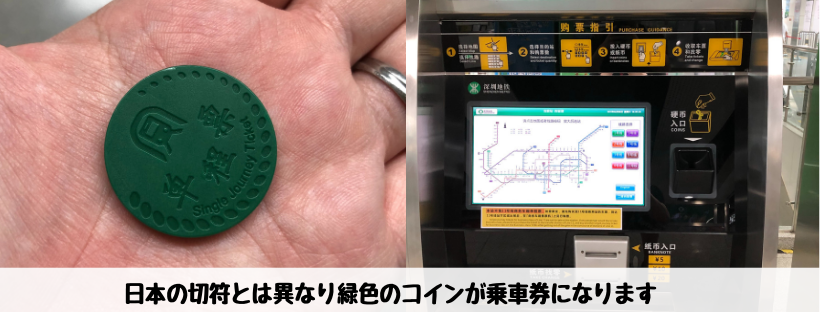
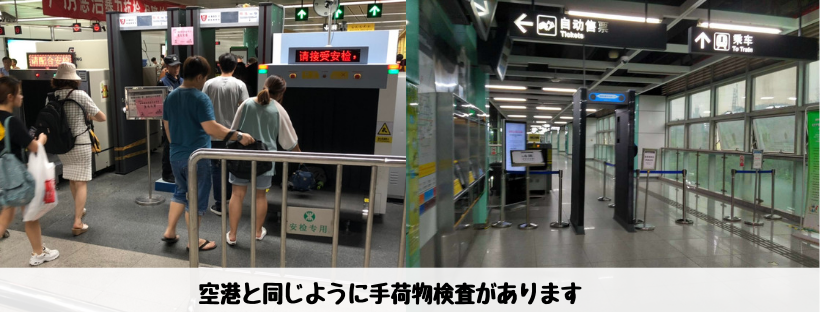
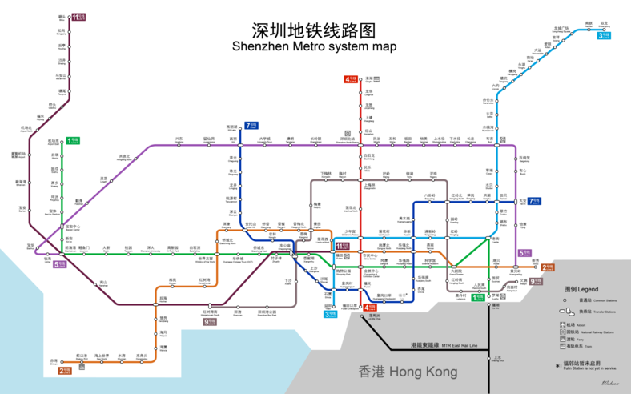

## はじめに

香港生活4年目のなかむ（[@nakanakamu0828](https://twitter.com/nakanakamu0828)）です。  

ここ数ヶ月深圳に出かけています。深圳での移動は主に地下鉄を利用しています。  
１駅１駅の区間も短く移動がしやすくて便利です。

## 乗車券の購入
深圳の地下鉄を乗る際は、コインを購入する必要があります。
日本の切符とは異なるプラスチックの緑色のコインです。

**☆☆☆注意点☆☆☆**

中国は**キャッシュレス**が進んでいるのは有名ですね！  
なので、深圳の人たちはスマホで直接改札を通ったり、乗車券の購入をスマホのQR決済で行います。  
私達外国人は現金の購入になりますが、**1元硬貨**と**5元札**しか使えない券売機があります。  
**老街**がそうでした。比較的大きな駅は利用できるお金種類が限定的なので注意が必要です。

## どの駅も持ち物チェックがあります
日本では考えられないですが、深圳の駅では**X線検査による荷物チェック**や**金属探知機チェック**がどの駅でも行われます。  
警備員も最低２人はおり、荷物チェックと人のチェックが行われます。  

さらに、ペットボトル内の水をチェックされます。  
未開封だと「**飲んでみて！**」と言われます。水に見せかけた危険物が入ってないかチェックする為です。

やっていることが空港と一緒でびっくりします。

混んでる駅だと行列ができて大変です・・・

## 地下鉄MAP

## 今後試してみたいこと
深圳にはまた出かけたいと思います。より深圳ライフを充実させる為、以下を試してみたいです。

- **Alipay（香港版）アプリを利用して深圳で地下鉄が乗れるか？**
- **銀嶺カードなど他の決済手段を使ってキャッシュレスで地下鉄に乗れるか？**
- **キャッシュレス対応が無理なら交通カードで地下鉄に乗る**

## 最後に
深圳に行った際は地下鉄を是非乗ってみてください！