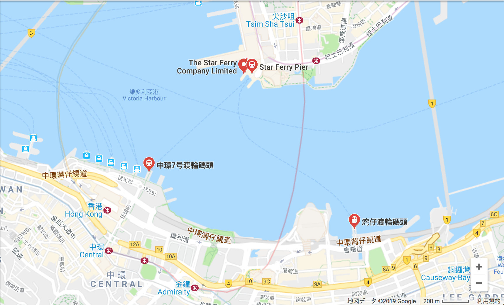
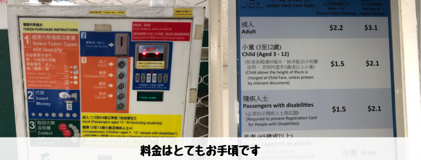
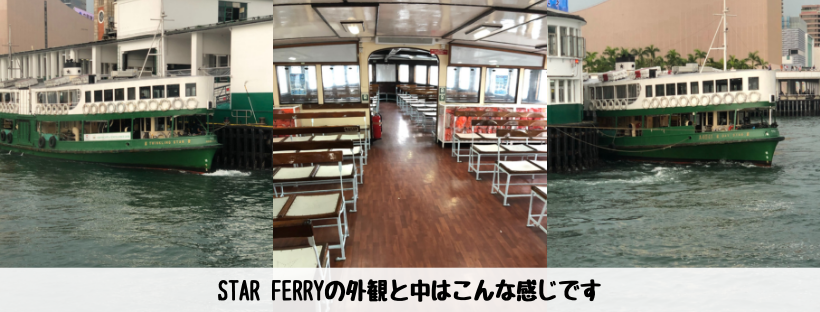
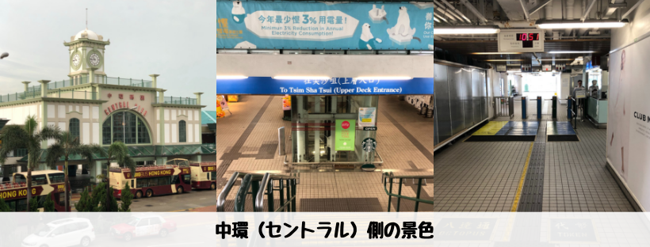
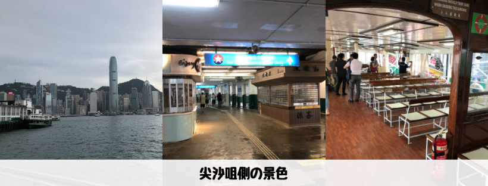

## はじめに

香港生活4年目のなかむ（[@nakanakamu0828](https://twitter.com/nakanakamu0828)）です。  
本日は**Star Ferry（天星小輪）**を利用して会社に向かいました。  
中環（セントラル）から尖沙咀の区間を利用しています。そんな**Star Ferry（天星小輪）**のご紹介です。

## 運行区間
- **中環（セントラル）<-> 尖沙咀**  
- **湾仔 <-> 尖沙咀**  

**香港島の都心部**と**九龍島の都心部**をつなぐ重要な交通手段の１つです。

## 料金

- **中環（セントラル）<-> 尖沙咀**

  |  | 月〜金 | 土日祝 |
  |:---|:---|:---|
  | **大人** | $2.2 or $2.7 | $3.1 or $3.7 |
  | **子供（3〜12歳）** | $1.5 or $1.6 | $2.1 or $2.2 |
  | **65歳以上** | 無料 | 無料 |

- **湾仔 <-> 尖沙咀**

  |  | 月〜金 | 土日祝 |
  |:---|:---|:---|
  | **大人** | $2.7 | $3.7 |
  | **子供（3〜12歳）** | $1.6 | $2.2 |
  | **65歳以上** | 無料 | 無料 |

交通機関の中でも2, 3香港ドルで乗ることができるのはかなりお得ですね！

## 写真

## 参考情報
- [天星小輪有限公司](http://www.starferry.com.hk/en/home)

## 最後に
MTRでも海を超えられますが、たまにはStar Ferryでのんびり景色を見ながら海を渡ってみてはどうでしょうか？
