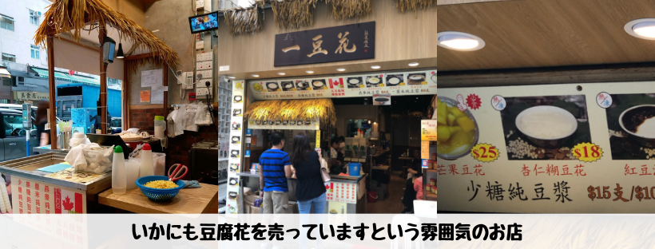
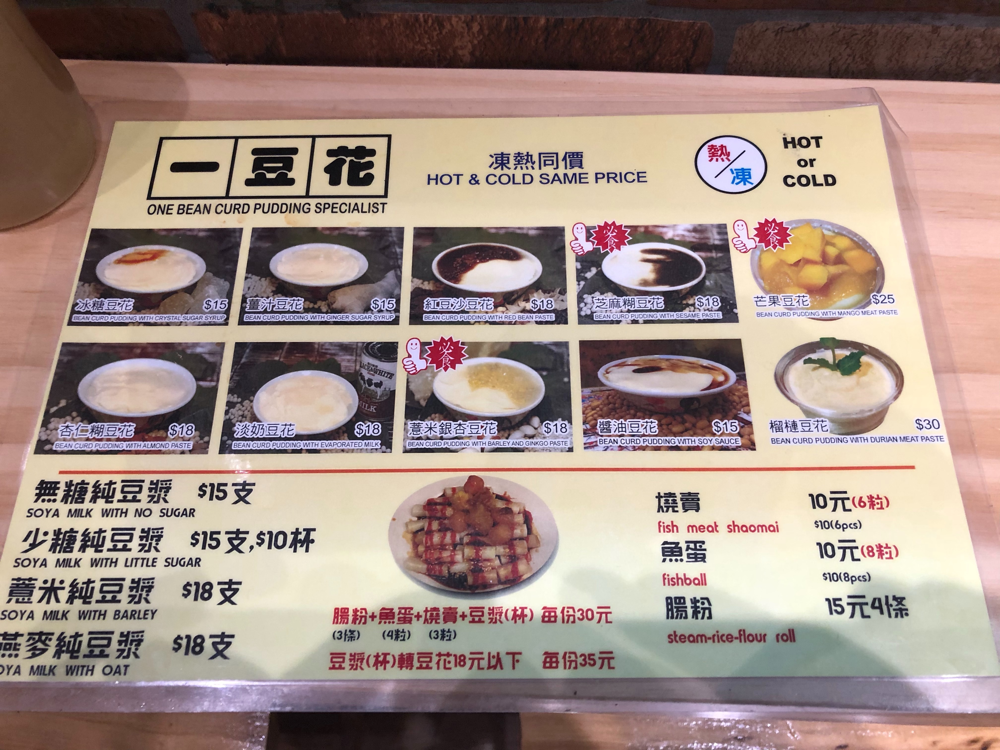
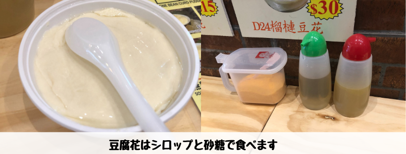

## はじめに

香港生活4年目のなかむ（[@nakanakamu0828](https://twitter.com/nakanakamu0828)）です。  

ランチ終わりに佐敦を歩いていたら「**一豆花**」という**豆腐花**のお店を見つけました。  
久しぶりに晴れて暑かったので冷たい豆腐花は最高に美味しかったです。ペッパーランチを食べた後だったので、口の中がさっぱりしました。

## 「豆腐花」とは？

名前の通り**豆腐**です。杏仁豆腐のような柔ないぷるんぷるんな豆腐なのですが、材料は**豆乳**なので日本の豆腐と作りは変わりありません。  
日本では醤油で冷奴を食べますが、**豆腐花**は砂糖や甘いシロップをかけて食べるデザートです。  

## 写真（メニュー・店舗）

いかにも豆腐のお店ですっと主張してました 笑  
豆腐花以外にも臭豆腐や豆乳も売っています。

今回は一番安い15HKDの冷たい豆腐花を食べました。  
熱い豆腐花もありますが、デザートとして食べるなら冷たい方が美味しいですよね！

豆腐花は甘いシロップや砂糖で食べます。  
オレンジ色の砂糖は何が入っているんでしょうね・・・
シロップは
 
 - 通常のシロップ
 - 生姜入りのシロップ

の２つがあります。生姜でピリッと食べてもいいと思います。なんだか健康に良さそうな気がしました。

## 基本情報

| 項目 | 詳細 |
|:---|:---|
|  **店名**  |  一豆花  |
|  **電話番号**  |  (+852) 37052592  |
|  **住所**  |  32號 Parkes St, Yau Ma Tei  |

<iframe src="https://www.google.com/maps/embed?pb=!1m18!1m12!1m3!1d7382.415957873887!2d114.16634437493049!3d22.307972791278125!2m3!1f0!2f0!3f0!3m2!1i1024!2i768!4f13.1!3m3!1m2!1s0x34040125430fe25b%3A0x4aa6db9e9068f47c!2z5LiA6LGG6Iqx!5e0!3m2!1sja!2shk!4v1560599553224!5m2!1sja!2shk" width="600" height="450" frameborder="0" style="border:0" allowfullscreen></iframe>

## 参考情報
- [一豆花 - OpenRice](https://www.openrice.com/en/hongkong/r-one-bean-curd-pudding-specialist-yau-ma-tei-hong-kong-style-dessert-r528411)

## 最後に
日本ではタピオカが再ブームのようですが、香港では当たり前のようにあります。  
マンゴーをはじめデザートの種類も豊富ですので、皆さん香港旅行の際にお立ち寄りください！
