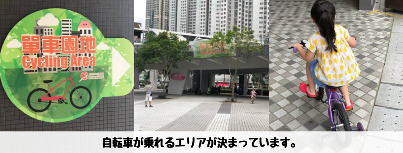
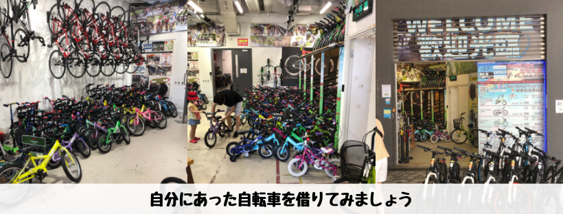

## はじめに

香港生活4年目のなかむ（[@nakanakamu0828](https://twitter.com/nakanakamu0828)）です。  

今回は、娘が「**自転車に乗りたい**」と言うので**レンタサイクル**に行ってきました。  
以前[「将軍澳運動場」まで家族で散歩しに行きました](https://enjoyhk.nakamu.life/post/2019/05/25/tseung_kwan_o/)で紹介しましたが、**單車館停車場**にレンタサイクルがあります。  

今回はそちらに行ってきました。

<embed-post-card href="/2019/05/25/tseung_kwan_o/"></embed-post-card>

## 料金
以下の画像をご確認ください。  
今回は子供用の自転車を1時間借りてみました。

- 1時間利用
- 1日(6時間)利用

と２種類の時間設定があります。

**☆☆☆本人確認☆☆☆**が必要になります。私は香港IDを利用しました。  
IDがまだ発行されていない方は、パスポートなど身元確認ができるものが必要です。

## 写真

## 基本情報

| 項目 | 詳細 |
|:---|:---|
|  **店名**  |  單車館停車場  |
|  **住所**  |  Kwong Ming Court Kwong Sun House, 108 Po Hong Rd  |

<iframe src="https://www.google.com/maps/embed?pb=!1m18!1m12!1m3!1d3691.0523903845724!2d114.25833011422586!3d22.313858298043048!2m3!1f0!2f0!3f0!3m2!1i1024!2i768!4f13.1!3m3!1m2!1s0x340403f4bc76163d%3A0xe4add775feb717!2z5Zau6LuK6aSo5YGc6LuK5aC0!5e0!3m2!1sja!2shk!4v1560742516124!5m2!1sja!2shk" width="600" height="450" frameborder="0" style="border:0" allowfullscreen></iframe>

## 参考情報
- [戶外設施](https://www.lcsd.gov.hk/tc/parks/vdp/facilities/outdoor.html)
- [HK Velodrome G50 - facebook](https://www.facebook.com/pages/category/Sports---Recreation/HK-Velodrome-G50-1701443110097647/)

## 最後に
皆さんもお子さんと一緒にサイクリングしてみてはどうでしょうか？  
中国でQRコード決済で乗れる自転車が流行っていますね。香港にもあるのですが、私が知る限り子供用はありません。  
なので、子供用に提供してくれているのは嬉しいですね！

## 関連投稿
<embed-post-card href="/2019/05/25/tseung_kwan_o/"></embed-post-card>

