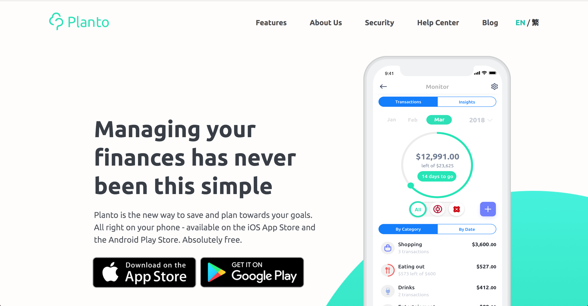
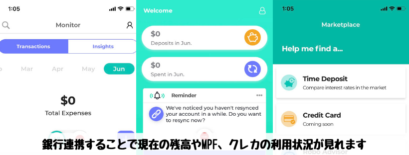

香港生活4年目のなかむ（[@nakanakamu0828](https://twitter.com/nakanakamu0828)）です。  

皆さんは資産管理アプリ「[Planto](https://www.planto.hk/en/)」をご存知でしょうか？
私は今年の4月頃に初めて知り、どんな機能があるか知りたいということもあり、使い始めました。

日本でいうところの[マネーフォワード](https://moneyforward.com/)のような預金状況やクレジットカードの利用状況など資産を連携することで自動管理してくれるアプリです。

私はHSBCの口座とクレカしか利用していないので、使いこなせていない感じがありますが・・・  
残高の確認やクレカの支払金額、MPFの状況などグラフと数値を定期的にチェックしています。  
支出が多い月は「やば！！もっと頑張って稼ごう！」という気になります。  
お金の放置は危険です。便利なアプリは使って資産を見える化しましょう。

皆さんも「**Planto**」を利用してみてください。  
アプリは以下からご登録ください。

