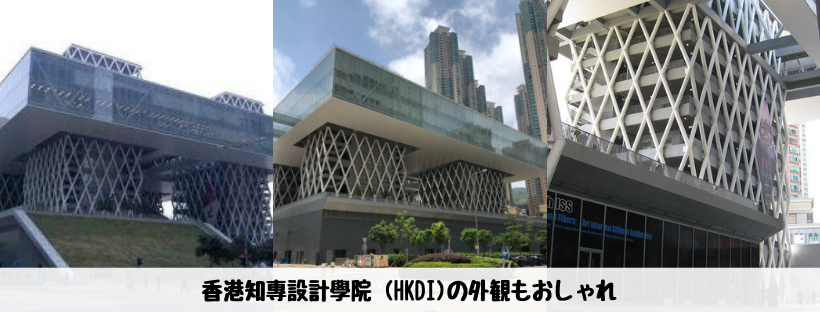
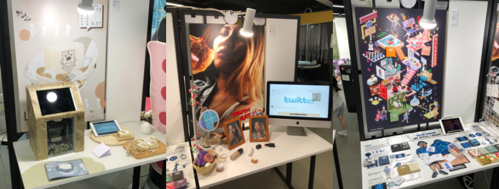
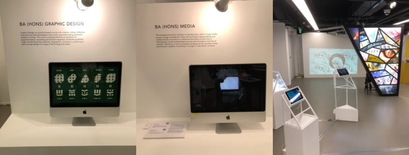
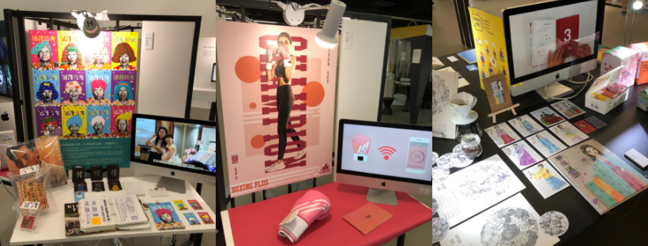
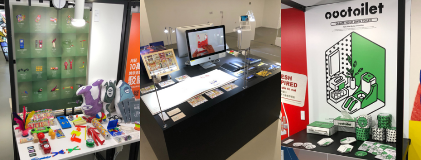
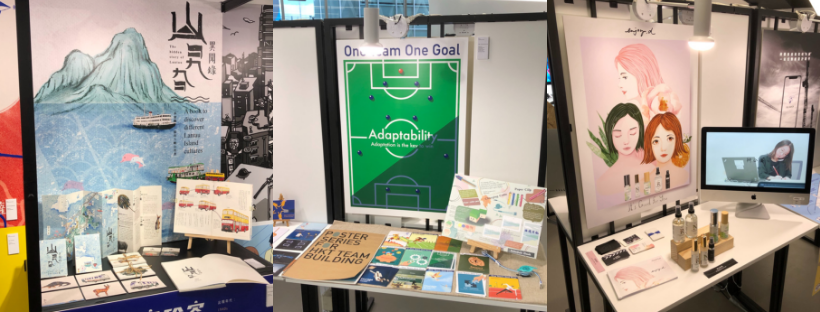
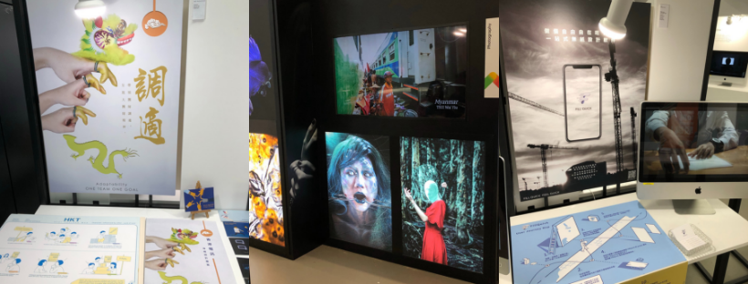

## はじめに

香港生活4年目のなかむ（[@nakanakamu0828](https://twitter.com/nakanakamu0828)）です。  

家族で歩いて将軍澳まで出かけている際に、**香港知專設計學院 (HKDI)**を通ったら、展覧会がやっていました。  
デザインが凄くかっこよかったので取ってきた写真を共有します。  
6/23までですので、皆さんも是非行ってみてください。

## イベントについて

### イベント期間
2019年6月13〜23日

### 開放時間
10:00am - 8:00pm

http://www.hkdi.edu.hk/tc/edt/edt.php を引用させてもらいました

***☆☆☆6/23で終了です！！☆☆☆***

## 写真

## 基本情報

| 項目 | 詳細 |
|:---|:---|
|  **名称**  |  香港知專設計學院  |
|  **住所**  |  Kwong Ming Court Kwong Sun House, 108 Po Hong Rd  |
|  **サイト**  |  http://www.hkdi.edu.hk/tc/  |

<iframe src="https://www.google.com/maps/embed?pb=!1m18!1m12!1m3!1d3691.2673120978766!2d114.2512613149548!3d22.305727985320686!2m3!1f0!2f0!3f0!3m2!1i1024!2i768!4f13.1!3m3!1m2!1s0x340403efc96dcf71%3A0x155421d8c0f5fab8!2sHKDI!5e0!3m2!1sja!2shk!4v1560918009836!5m2!1sja!2shk" width="600" height="450" frameborder="0" style="border:0" allowfullscreen></iframe>

## 参考情報
- [香港知專設計學院 - ホームページ](http://www.hkdi.edu.hk/tc/)
- [香港知專設計學院 - 年度設計展2019](https://www.art-mate.net/doc/54094?name=%E5%B9%B4%E5%BA%A6%E8%A8%AD%E8%A8%88%E5%B1%952019)
- [香港知專設計學院 - Facebook](https://www.facebook.com/HongKongDesignInstitute)

## 最後に
皆さんもデザイン感覚を養いましょう 笑  
私はデザイナーではないのでデザイン感覚無知ですが、エンジニアという特性上、デザイナーと共同で開発をします。  
開発だけでなくデザインもできたらスムーズなんだよなーと思いながら日々仕事をしています。  
なので、大変興味深かったです。  

あと、子供を感性豊かに育てるためにデザイン作品を見せることもいいのではないでしょうか？  
素敵なデザインですので、「**私も作りたい**」と興味を持ってもらえたらいいですよね。  
