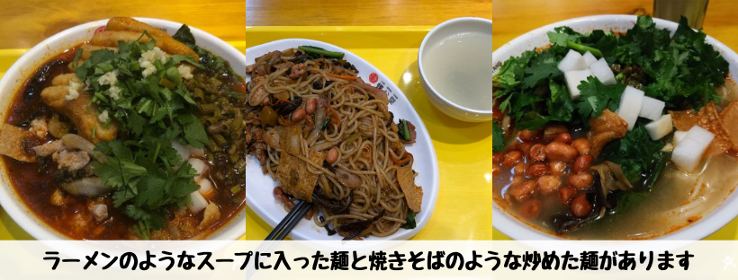
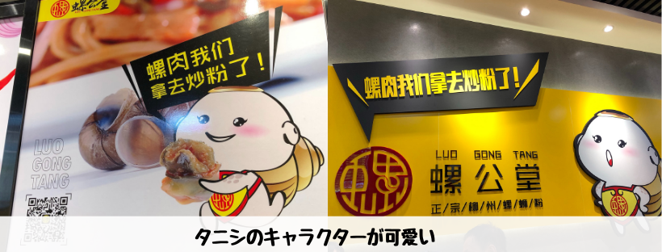
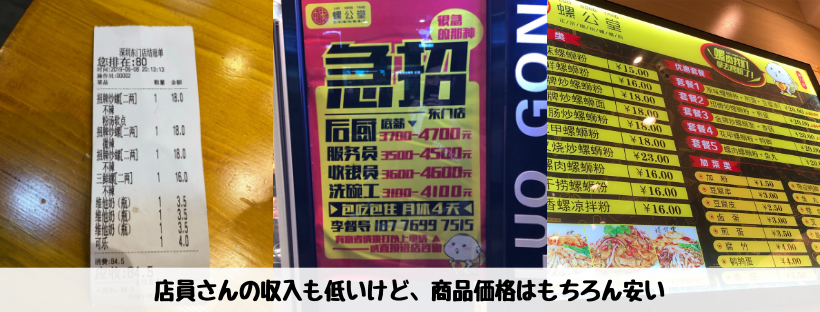

## はじめに

香港生活4年目のなかむ（[@nakanakamu0828](https://twitter.com/nakanakamu0828)）です。  

深圳に出かけた際に食べた「**柳州螺蛳粉**」の紹介です。**タニシ**が入ったライスヌードルになります。  
お店は「[螺公堂柳州螺蛳粉](http://www.dianping.com/shop/129359105)」になります。

## 「タニシ」とは？

> タニシ科に分類される巻貝の総称。
> 南米と南極大陸を除く各大陸とその周辺地域の淡水に生息し、雌雄異体の卵胎生である。一般的に、殻口をぴったりと塞げる蓋を持つ。リンゴガイ科（スクミリンゴガイ等）と並び淡水生の巻貝としては大型の種を含む。

[wikipedia - タニシ](https://ja.wikipedia.org/wiki/%E3%82%BF%E3%83%8B%E3%82%B7)を参照

巻貝のようですね。日本だと田んぼやその近くの用水路でよく見かけますね。
実際に使われているタニシは食用で種類が違うものだと思います。

## 写真（メニュー・店舗）

私は、焼きそばのような炒めた麺の方が美味しかったです！  
辛いのでご注意を！！

30席くらいの小さなお店です。  
チェーン店だと思いますが、比較的綺麗な店舗で入りやすいと思います。

こちらのお店には、タニシのキャラクターがいるようです。  
なんか可愛くて笑ってしまいました 笑

深圳とはいえまだまだ物価が安いです。地元民と同じような食生活をするとかなり節約になります。  

## 基本情報

| 項目 | 詳細 |
|:---|:---|
|  **店名**  |  螺公堂柳州螺蛳粉  |
|  **電話番号**  |  (+852) 19146489902  |
|  **住所**  |  深圳老街立新路13-2  |

**☆☆☆Google Mapは中国で利用できないのでご注意ください☆☆☆**

<iframe src="https://www.google.com/maps/embed?pb=!1m18!1m12!1m3!1d4427.813991226635!2d114.1163176851469!3d22.548382510436365!2m3!1f0!2f0!3f0!3m2!1i1024!2i768!4f13.1!3m3!1m2!1s0x3403f5bd8be174e5%3A0x9a67e3310a26ac60!2zMTMtMiBMaSBYaW4gTHUsIERvbmcgTWVuLCBMdW9odSBRdSwgU2hlbnpoZW4gU2hpLCBHdWFuZ2RvbmcgU2hlbmcsIOS4reiPr-S6uuawkeWFseWSjOWbvSA1MTgwMjY!5e0!3m2!1sja!2shk!4v1561017029305!5m2!1sja!2shk" width="600" height="450" frameborder="0" style="border:0;" allowfullscreen></iframe>

## 参考情報
[螺公堂柳州螺蛳粉](http://www.dianping.com/shop/129359105)

## 最後に
日本では中々食べれないと思います。チャレンジングな性格な方は是非試してみてください。  
味はとても美味しいです。辛いので注意が必要ですが！

## 関連投稿
<embed-post-card href="/2019/06/07/lowu/"></embed-post-card>
<embed-post-card href="/2019/06/07/shenzhen_metro/"></embed-post-card>
