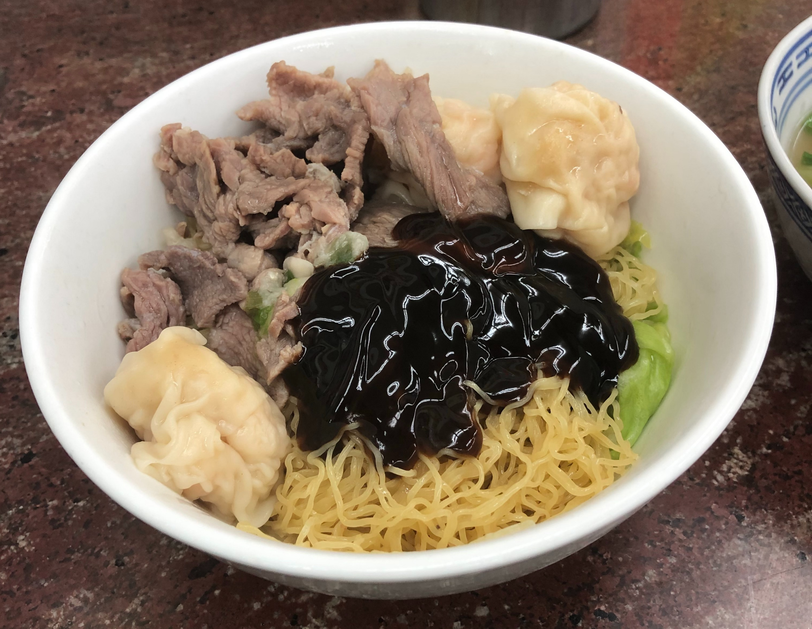
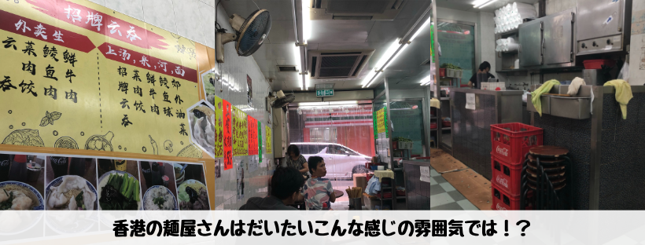
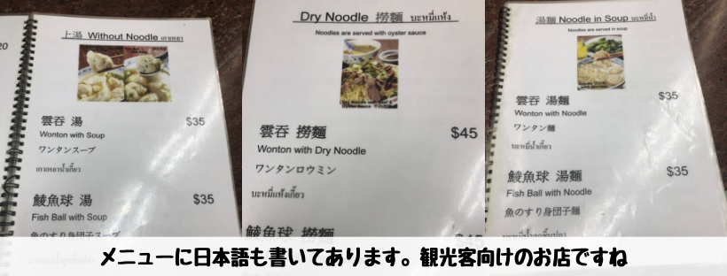
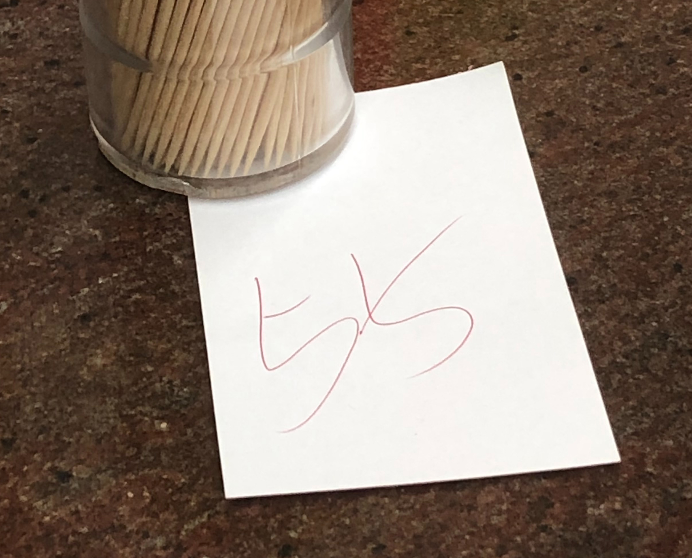

## はじめに

香港生活4年目のなかむ（[@nakanakamu0828](https://twitter.com/nakanakamu0828)）です。  

以前の投稿で「香港に来たら是非食べて欲しいのが**お粥**です 」とお伝えしましたが、**雲呑麺**も是非食べて欲しい一品です。  
私は、香港に来たばかりの頃はよく**雲呑麺**を食べていました。  
食べすぎて少し飽きてたり・・・

今回ご紹介する「**錫記招牌雲吞**」は**雲呑**が有名なお店のようですね。  
芸能人の写真も貼られていました。

今回は、雲呑麺ではなく雲呑入りの**撈麺（ロウミン）**を食べてみました。

## 写真（メニュー・店舗）

食べたのはこちらの**雲呑牛肉雲呑**です。茹でた雲呑と麺（雲呑麺の麺と同じ）、牛肉とオイスターソースようなソースを混ぜて食べます。

如何にもローカルな香港のお店です。ちょっと入りにくい方もいるかもしれませんが、美味しいので私は気になりません。  
お粥屋さんもそうでしたが、麺屋さんも香港のお店は似たような作りになっていますね

観光客も多いようで、メニューは日本語も書かれています。

紙に数字が書かれた紙を渡されます。これがレシートです。合計金額が記載されています。

## 基本情報

| 項目 | 詳細 |
|:---|:---|
|  **店名**  |  錫記招牌雲吞  |
|  **電話番号**  |  (+852) 23174649  |
|  **住所**  |  尖沙咀宜昌街5號B舖  |

<iframe src="https://www.google.com/maps/embed?pb=!1m18!1m12!1m3!1d3691.501242674759!2d114.1685985149546!3d22.29687538532534!2m3!1f0!2f0!3f0!3m2!1i1024!2i768!4f13.1!3m3!1m2!1s0x340400f27ce49ab5%3A0xa81d2529d4e15a45!2z6Yyr6KiY5oub54mM6Zuy5ZGR!5e0!3m2!1sja!2shk!4v1561175495975!5m2!1sja!2shk" width="600" height="450" frameborder="0" style="border:0" allowfullscreen></iframe>

## 参考情報
- [錫記招牌雲吞 - OpenRice](https://www.openrice.com/en/hongkong/r-shek-kee-wanton-noodles-tsim-sha-tsui-hong-kong-style-noodles-rice-noodles-r5764)
- [錫記招牌雲吞  - 食べログ](https://tabelog.com/hongkong/A5201/A520101/52001963/)

## 最後に
お粥と同様雲呑麺も香港旅行の際に食べてみてください！
