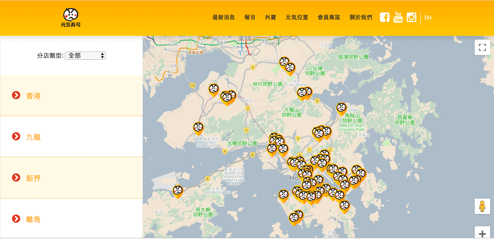
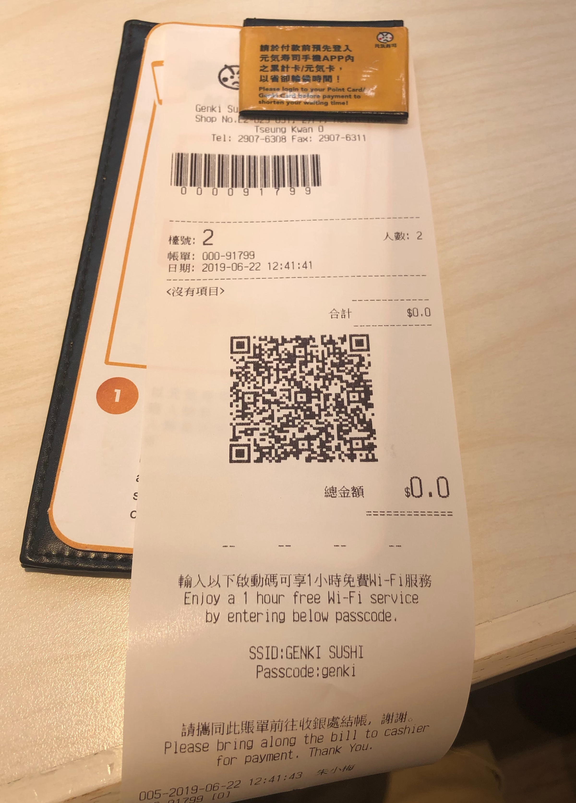
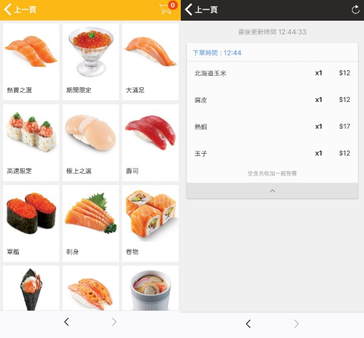
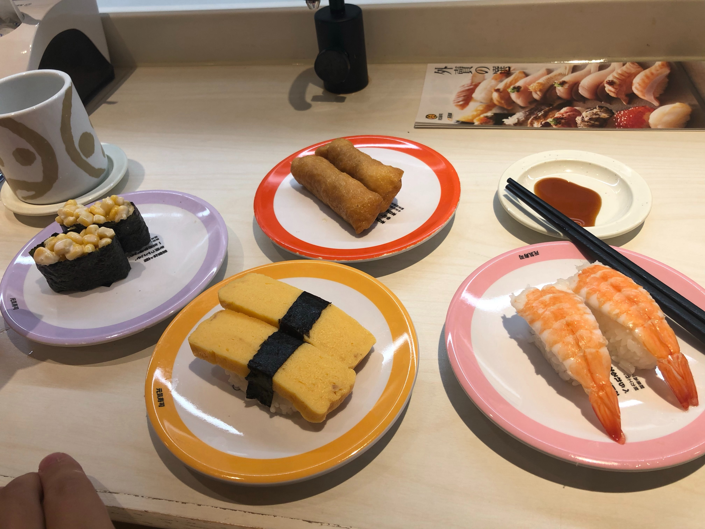

## はじめに

香港生活4年目のなかむ（[@nakanakamu0828](https://twitter.com/nakanakamu0828)）です。  

娘と遊びに出かけていてたまたま**元気寿司**の前を通った時に、娘が「お寿司食べたい」と言うので**都會駅元気寿司高速線**店でお寿司を食べて来ました。

香港の元気寿司の店舗を知りたい方は、[こちら](https://www.genkisushi.com.hk/tc/location.php)のホームページをご確認下さい。

## 都會駅元気寿司高速線店のシステム

1. 店舗入口に予約用の機械が置いてありますので、人数を選択して予約してください。  
予約用の番号が入った紙が出力されるので、店員さんに呼ばれるまで待ちましょう。
（機械の写真撮るの忘れたので今度撮ってきます）

2. 席に通されたら伝票が渡されます。その紙にQRコードが書いてるので、専用アプリで読み込むかQRコードリーダーからWebサイトに移動しましょう。

  ※ アプリをインストールしていないので、今回はWebサイトを利用しました

3. QRコードからWebサイトを起動すると、店舗情報と座席情報が記載されたページが表示されます

4. サイトを進めるとメニュー一覧が表示されます。そこからお寿司を注文することが可能です。

5. 注文が終わったら新幹線のような高速電車で寿司が運ばれてくるのを待ちます。

## 都會駅元気寿司高速線店の注意点
私は広東語がわからないので、伝票渡されて席についたときにメニューがなく注文方法わからねーって思いました 笑
アプリインストールから始めないといけないのかよ！って思いつつ、QRコードを読み取ったら注文ページに遷移したので助かりました。

でもこれ、スマホとネットがないと注文できないので、いきなり入った店がそのような店舗だと困る人いるだろうなーっと思いました。

## 元気寿司（都會駅元気寿司高速線） - 基本情報

| 項目 | 詳細 |
|:---|:---|
|  **名称**  |  元気寿司（都會駅元気寿司高速線）  |
|  **住所**  |  將軍澳調景嶺景嶺路8號都會駅2樓29-31號舖  |
|  **電話番号**  |  (+852) 29076308  |
|  **営業時間**  |  11:30am–10:30pm  |
|  **サイト**  |  https://www.genkisushi.com.hk/tc/ |

<iframe src="https://www.google.com/maps/embed?pb=!1m18!1m12!1m3!1d3691.288061981546!2d114.24970191495477!3d22.304942885321136!2m3!1f0!2f0!3f0!3m2!1i1024!2i768!4f13.1!3m3!1m2!1s0x340403ef76689d41%3A0xb0e5a0bd8d2f1d79!2z6YO95Lya6aeF5ZWG5aC0!5e0!3m2!1sja!2shk!4v1561307948967!5m2!1sja!2shk" width="600" height="450" frameborder="0" style="border:0" allowfullscreen></iframe>

## 最後に
香港在住の日本人の方はお寿司食べてくなりませんか？  
香港にも美味しい和食の店はいっぱいありますし、お寿司のネタも素晴らしいところがあります。  
ただ、そう言うお店はかなり高いので、手頃な価格でお寿司を食べたいときは**元気寿司**にいってみては如何でしょうか？

私は日本に帰国するたびに、いっぱい寿司食べます 笑
