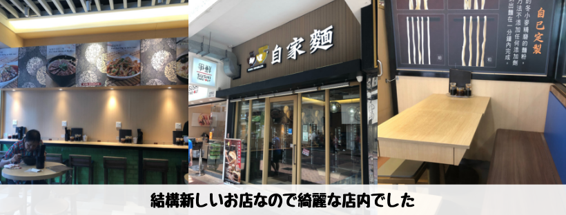
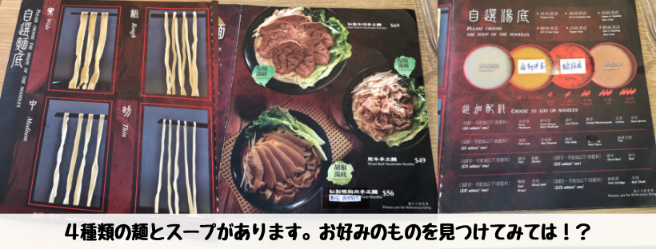
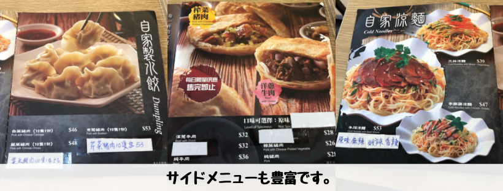
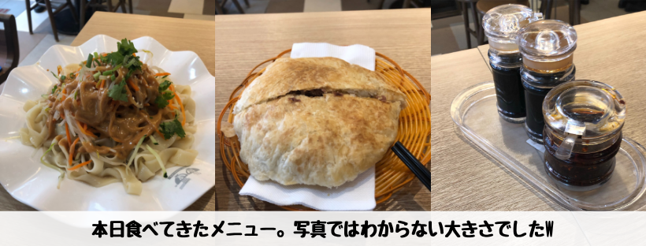
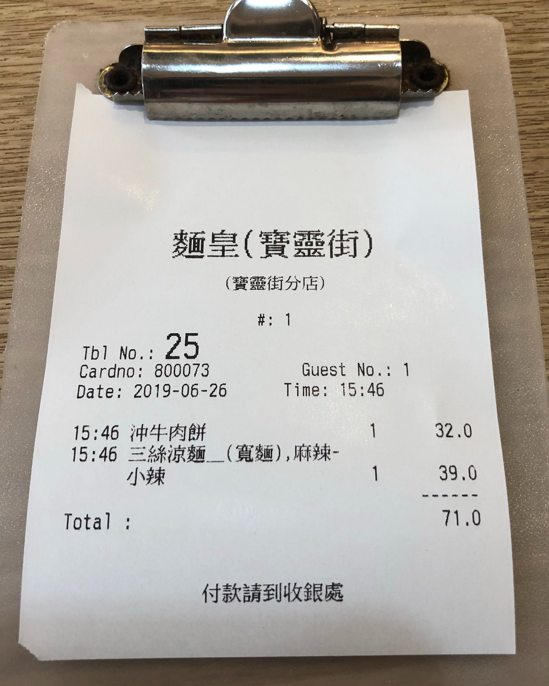

## はじめに

香港生活4年目のなかむ（[@nakanakamu0828](https://twitter.com/nakanakamu0828)）です。  

本日は、**佐敦**の「**麵皇自家麵**」という麺屋さんで**涼麵**と**牛肉餅**を食べてきました。  
外がジメジメ暑かったので冷えた涼麵でさっぱりと食すつもりが、麻辣味は小辛でも辛く逆に暑くなりました 笑
このお店は先日投稿した豆腐花のお店「**一豆花**」のすぐ近くです。辛いものを食べた後に甘くてさっぱりな**豆腐花**もいいですね。

<embed-post-card href="/2019/06/14/tofuhua/"></embed-post-card>

## 写真（メニュー・店舗）

新しいお店なのでとても綺麗でした。よく店の前を通りますが、ここ2, 3年でできたお店だと思います
（香港きてすぐはなかったので・・・）

メニュー豊富です。今度は涼麵ではなく辛いラーメンを食べてみようかと思っています。  
餃子も食べてみたいですね！！

ボリュームたっぷりでした。もう少し量は少なくてもいいかも・・・  
1品の量を減らして色々頼みたかったです

量が多かったので食べきれませんでした。ランチで麺屋で71HKDは少し高めなので、2品はいらなかったですね。

## 基本情報

| 項目 | 詳細 |
|:---|:---|
|  **店名**  |  麵皇自家麵  |
|  **電話番号**  |  (+852) 24331111  |
|  **住所**  |  佐敦寶靈街8-20號寶靈大樓地下16號舖  |
|  **営業時間**  |  11:00 - 23:30  |

<iframe src="https://www.google.com/maps/embed?pb=!1m18!1m12!1m3!1d3691.290992968983!2d114.16776721454926!3d22.30483198532129!2m3!1f0!2f0!3f0!3m2!1i1024!2i768!4f13.1!3m3!1m2!1s0x340400eb9e89ba55%3A0xd65a7e08d82fe5bf!2z6Z2i55qH!5e0!3m2!1sja!2shk!4v1561565515928!5m2!1sja!2shk" width="600" height="450" frameborder="0" style="border:0" allowfullscreen></iframe>

## 参考情報
- [麵皇自家麵 - OpenRice](https://www.openrice.com/zh/hongkong/r-%E9%BA%B5%E7%9A%87%E8%87%AA%E5%AE%B6%E9%BA%B5-%E4%BD%90%E6%95%A6-%E7%B2%B5%E8%8F%9C-%E5%BB%A3%E6%9D%B1-%E7%B2%89%E9%BA%B5-%E7%B1%B3%E7%B7%9A-r539574)

## 最後に
辛いもの好きな方は是非一度「**麵皇自家麵**」に行ってみるのは如何でしょうか？

## 関連投稿
<embed-post-card href="/2019/06/14/tofuhua/"></embed-post-card>
