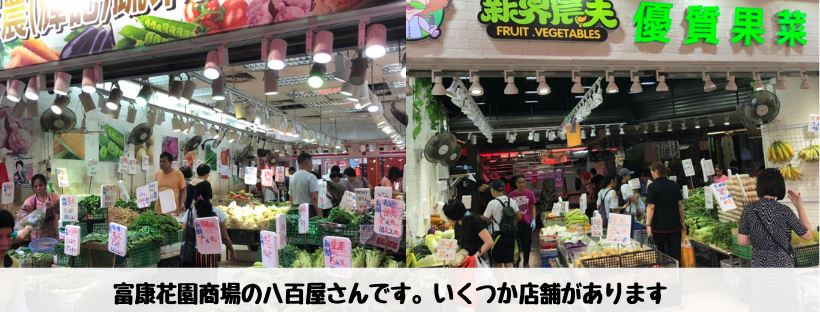
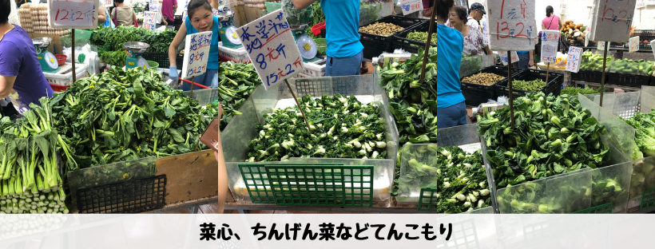
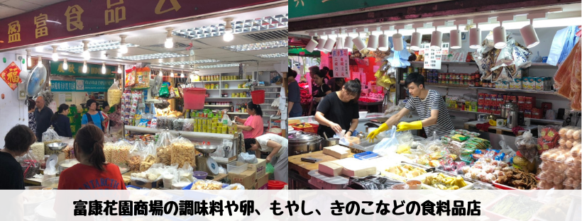
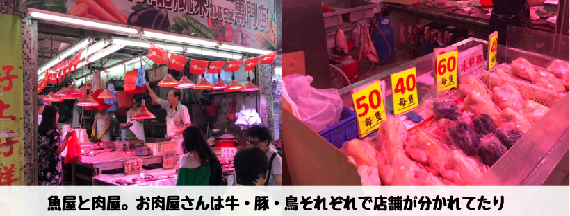
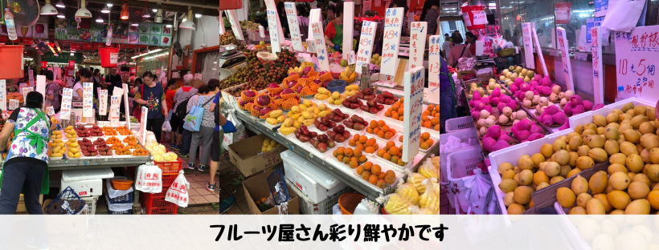
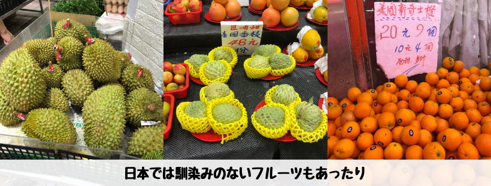

## はじめに

香港生活4年目のなかむ（[@nakanakamu0828](https://twitter.com/nakanakamu0828)）です。  

将軍澳によく出かけるのですが、ついでにスーパーや市場で買い物をします。今回はよく買い物に行く地元民が多い**富康花園商場**の市場の紹介です。  
ちなみに香港では市場のことを「**街市**」と言います。

**富康花園商場**は、以前紹介した**将軍澳運動場**の向かい側ですぐ近くにあります。

<embed-post-card href="/2019/05/25/tseung_kwan_o/"></embed-post-card>

## 街市の注意点
基本的に**計り売り**です。広東語が多少話せたり聞き取れないと購入が難しいです。  
「500グラム！」とか「1キロ」と重さで量を測ってもらうか、「10HKD」とか金額で量を測ってもらいます。  
私は全然広東語覚えていませんが、雰囲気でいつも乗り切ってます。優しいおじちゃん、おばちゃんも多いのです。何いってるかわからないですけど。

※ 言葉がわからないとぼったくられそうなものですけど・・・  
  他の国みたいにあからさまに値段が違うとか、量が違うとかないのです。信用する気持ちも大事かと！

## 写真

日本のスーパーでは見かけない野菜も多いです。知らない野菜ばかりで発見が多く楽しめます。  
私は、**菜心**や**通菜（空芯菜）**が好きですね！

なんでかわからないのですが、もやしやきのこは食料品店に売ってます。  
調味料は知らないものばかりです！ピータンが買いたい方も食料品店ですね！

魚屋や肉屋は注意が必要です。血が・・・  
豚の足や顔が吊り下げられていたり、耐性がないと行けないかもしれません。  
基本的にお肉屋は、牛屋、豚屋、鳥屋と分かれていて欲しいお肉があるお店に行くことになります。

以前もドリアンを紹介しましたが、南国のフルーツがいっぱいでカラフルな店舗になっています。

<embed-post-card href="/2019/05/30/dorian/"></embed-post-card>

## 基本情報

| 項目 | 詳細 |
|:---|:---|
|  **店名**  |  富康花園商場  |
|  **電話番号**  |  (+852) 22179000  |
|  **住所**  |  將軍澳唐明街1號富康花園商場  |

<iframe src="https://www.google.com/maps/embed?pb=!1m14!1m8!1m3!1d1813.8674004057764!2d114.26254566725076!3d22.310309962825986!3m2!1i1024!2i768!4f13.1!3m3!1m2!1s0x340403f356550ac3%3A0xd19feaa405e1aa29!2sBeverly+Garden+Shopping+Centre!5e0!3m2!1sja!2shk!4v1561604770203!5m2!1sja!2shk" width="600" height="450" frameborder="0" style="border:0" allowfullscreen></iframe>

## 最後に
冒険だと思って日本とは全然異なる街市にチャレンジしてみましょう！

## 関連投稿
<embed-post-card href="/2019/05/25/tseung_kwan_o/"></embed-post-card>
<embed-post-card href="/2019/05/30/dorian/"></embed-post-card>

