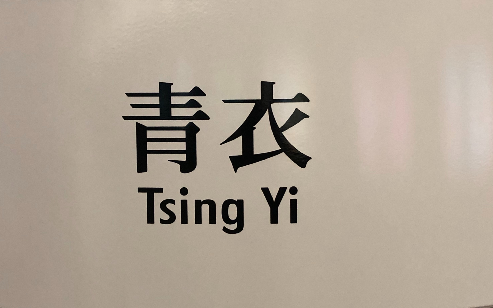
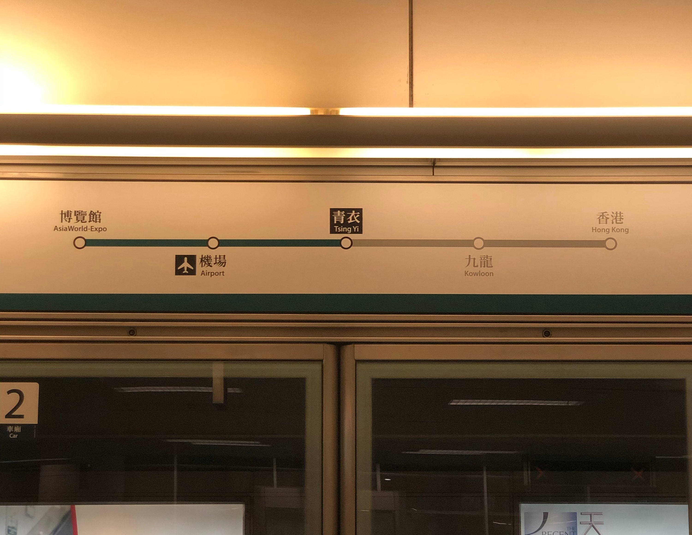
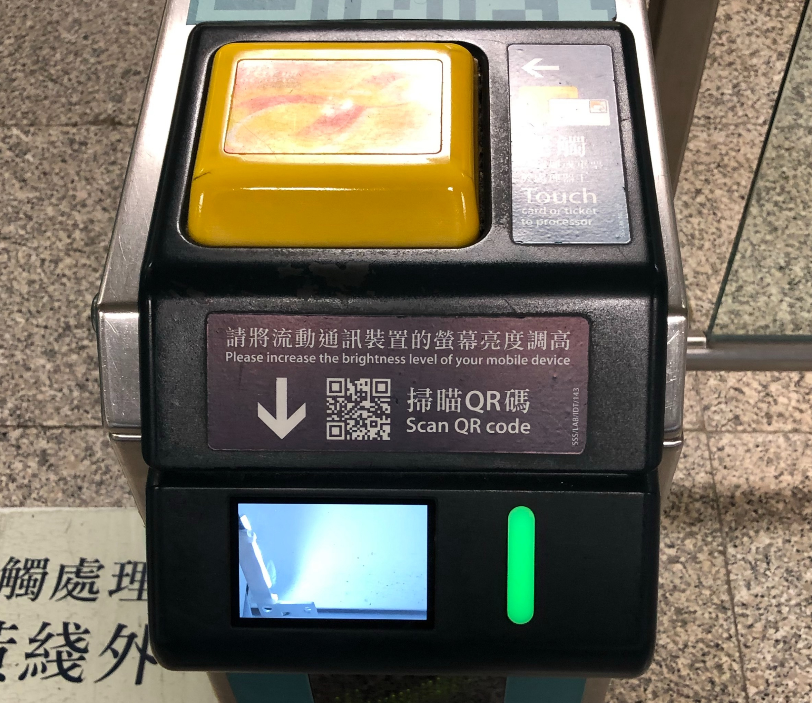
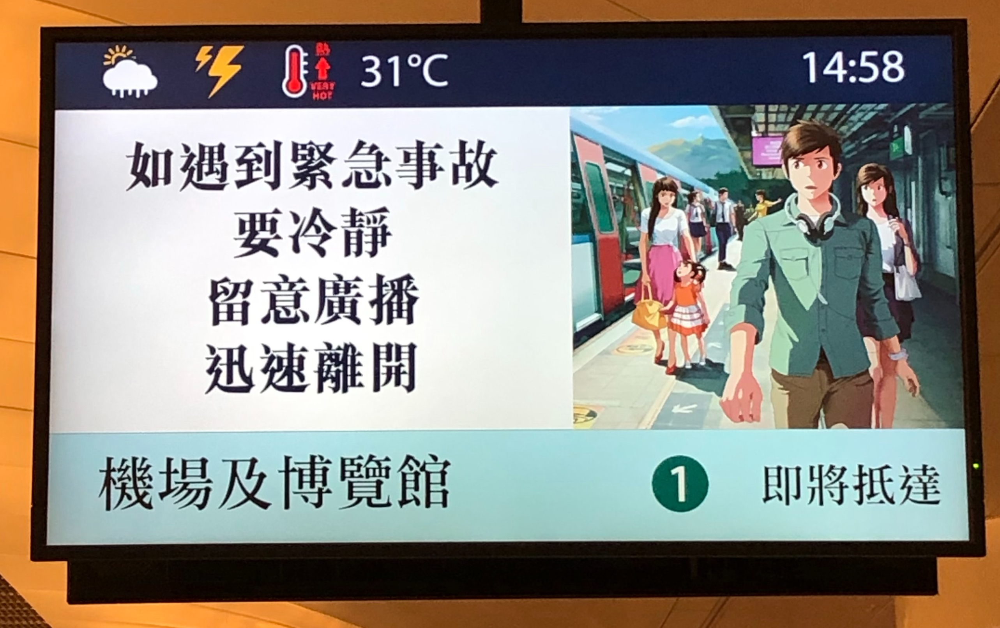
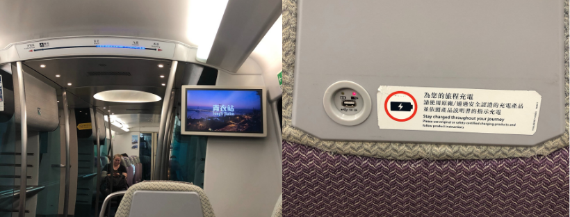
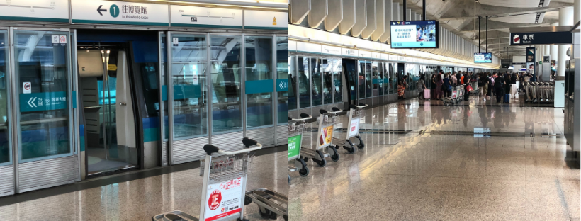

香港生活4年目のなかむ（[@nakanakamu0828](https://twitter.com/nakanakamu0828)）です。  

２日間日本に帰国します。会社の雑務や手続き系、納税など色々２日間でサクッと終わらせようと思っています。
香港 <--> 東京を日帰りとかしたことがあるのでもう飛行機は慣れました。

空港に行く方法ですが、

- **香港エアポートエクスプレス**
- **タクシー**
- **バス**

などがあります。  
今回は**青衣**から**香港エアポートエクスプレス**で空港に向かいました。  
青衣からだと14分で空港に到着します。  
バスは数回試したことがあるのですが、乗る場所によっては時間がかかるのでオススメできないです＞＜

支払いは**オクトパス**を利用しています。  
**オクトパス**については過去の投稿をご参照ください。

<embed-post-card href="/2019/05/27/octopus/"></embed-post-card>

**機場**方面の電車に乗ります。博覧館が終点となります。

USBケービブルで充電しつつのんびり空港に向かいます。  
空港に向かう電車はいつも空いているので、座れる可能性が高いですね

香港国際空港到着！

ググっていたら詳しくまとめてくださっている記事を見つけました。  
詳細については、以下の記事を参考にしてみてください！

- [2019年香港エアポートエクスプレス総まとめ!（割引チケット・時刻表・料金・情報購入方法など）写真多数](https://harumijp.com/express/)
- [香港エアポートエクスプレスとシャトルバスの乗り方まとめ](https://aoitrip.jp/hongkong-airport-express)
