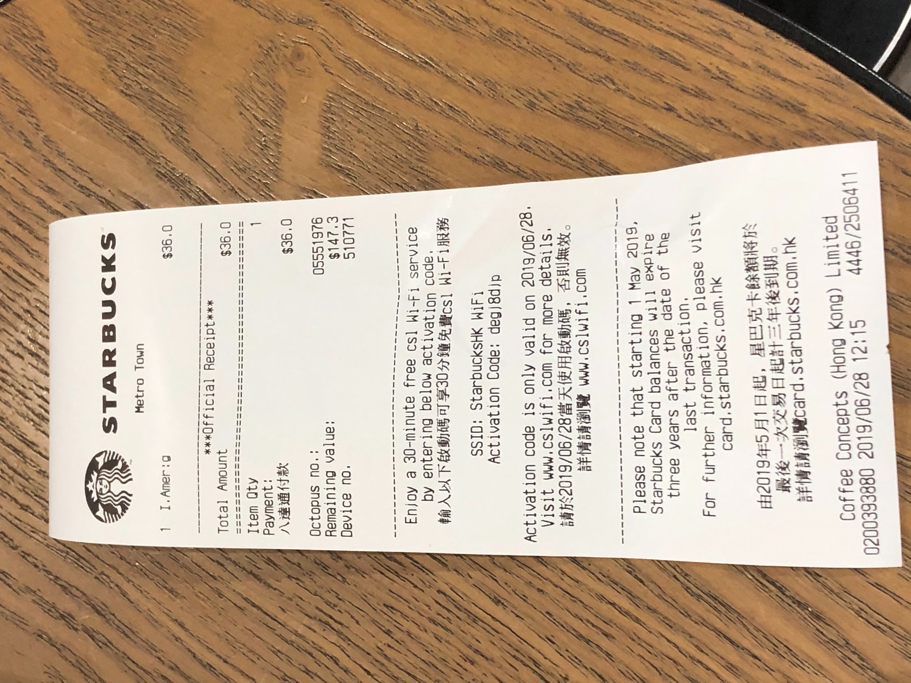
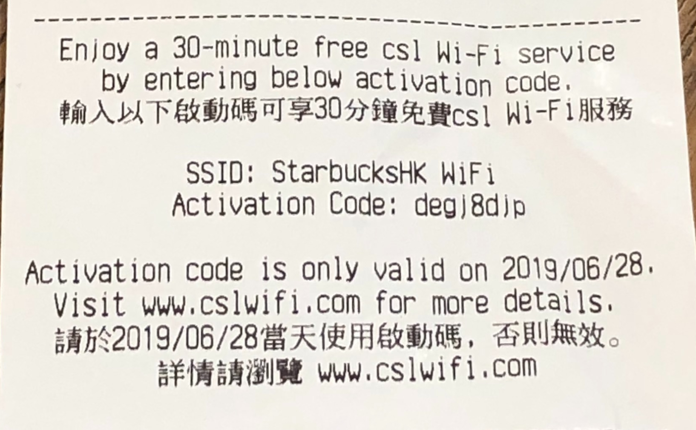
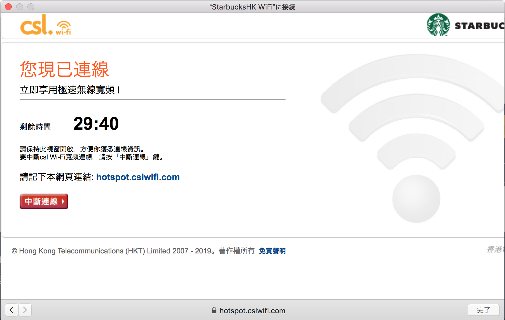
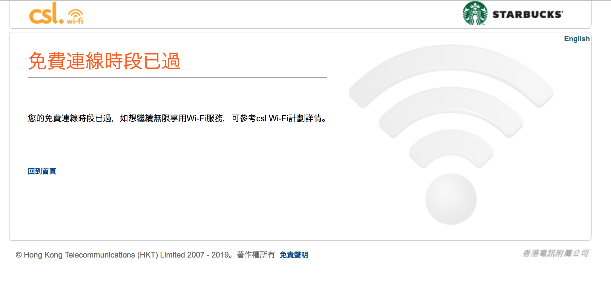

香港生活4年目のなかむ（[@nakanakamu0828](https://twitter.com/nakanakamu0828)）です。  

日本のコーヒー好きの皆さま、フラペチーノ好きな皆さまに同じみの**スターバックス**ですが、香港にももちろんあります。  
めちゃくちゃあります。どこにでもあります。くらい色々なところで見かけます。

ということで、コーヒーが好きな私は現在**スターバックス**にいます。

忘れていたのですが、香港のスターバックスでは商品を購入するとレシートにWifi情報が記載されているのでネットを使うことができます。
なぜ忘れていたかというと、日常的にiPhoneからインターネット共有をしてパソコンを利用しているので、意識せずiPhoneのネットに繋いでました・・・

Wifiを利用する方法は、

**1. コーヒーなど何か買いましょう**

**2. レシートを確認します**

**3. レシートにSSIDとパスワード（Activation Code）が記載されていますので、そちらを参照しWifiを繋げましょう**

簡単にWifiに繋ぐことができます。

Wifiは30分間有効です。ネット代節約の為にスターバックスで動画をダウンロードする香港人の方もいるみたいです。  
インターネット共有するとかただの無駄遣いですね・・・

30分が経過するとネットが切れます。

香港に旅行にきた皆さんもWifiが利用制限かかった場合、近くのスターバックスでネットを利用してみてください！！