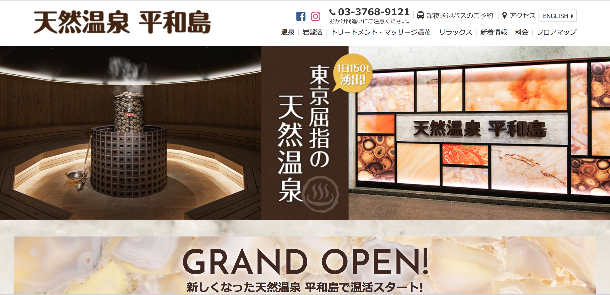
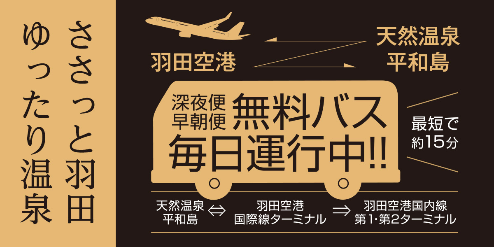
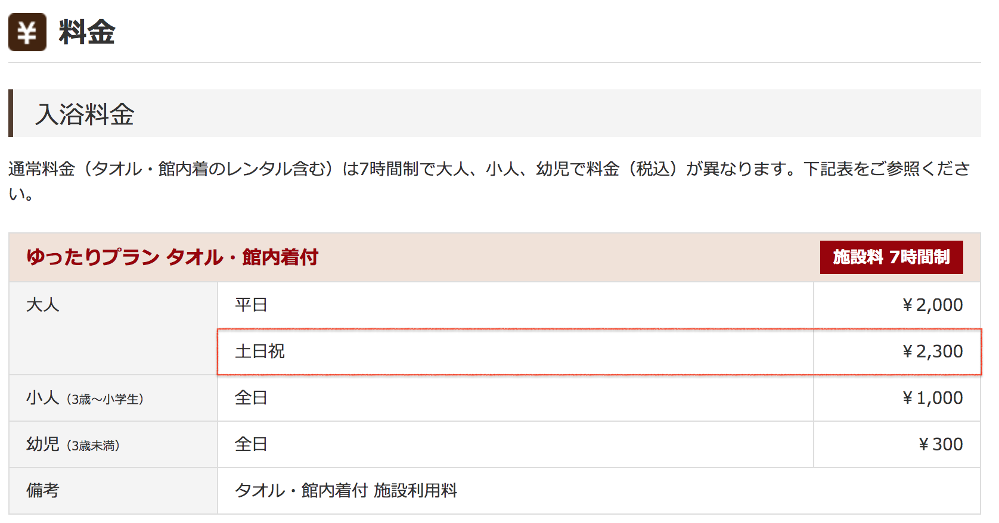

## はじめに

香港生活4年目のなかむ（[@nakanakamu0828](https://twitter.com/nakanakamu0828)）です。  

先日の投稿「[香港エアポートエクスプレスで空港へ](https://enjoyhk.nakamu.life/post/2019/06/28/airport_express/)」で、日本に一時帰国する旨お伝えさせて頂きましたが、その際に「**平和島温泉**」に立ち寄ってみました。  

<embed-post-card href="/2019/06/28/airport_express/"></embed-post-card>

最近ではLCCも増えて中途半端な時間（電車が走ってないなど）に羽田空港へ行くことも多いかと思います。  
私は日中の時間を飛行機で過ごすのが勿体なく感じてしまい、深夜便を利用することが多いです。  

そんな時は**温泉**に浸かってのんびり時間を潰しましょう。

ホームページはこちらから

https://www.heiwajima-onsen.jp/

## 平和島温泉 - アクセス

深夜早朝の時間帯に羽田空港<-->平和島温泉間の[無料送迎バス](https://www.heiwajima-onsen.jp/bus/)も出ています。

日中は、[ワンコインバス](https://www.heiwajima-onsen.jp/access/)を利用して100円で平和島温泉に行くことが可能です。  
以下の場所からバスが出ています。

- **JR 大森駅**
- **京急 平和島駅**
- **京急 大森海岸駅**

ホームページから時刻表が確認できますので、その時間に合わせて行ってみてください。

## 平和島温泉 - 料金

今回は日曜日に行ったので赤枠の7時間2,300円の料金でした。  
料金の詳細は[こちら](https://www.heiwajima-onsen.jp/price/)  

入館時に鍵が渡されます。それにバーコードがついており、館内で食事や飲み物の購入をする場合、そのバーコードから買い物ができます。  
会計は退館するまとめて行います。

## 平和島温泉 - 温泉
温泉情報を確認したい方は、[こちら](https://www.heiwajima-onsen.jp/spa/)をご確認ください。  
天然温泉で複数種類の温泉が用意されています。  

## 基本情報

| 項目 | 詳細 |
|:---|:---|
|  **店名**  |  平和島温泉  |
|  **電話番号**  |  (+81) 03-3768-9090  |
|  **住所**  |  東京都大田区平和島１丁目１−１  |
|  **ホームページ**  |  https://www.heiwajima-onsen.jp/  |

<iframe src="https://www.google.com/maps/embed?pb=!1m14!1m8!1m3!1d3244.760288292215!2d139.740554!3d35.584308!3m2!1i1024!2i768!4f13.1!3m3!1m2!1s0x0%3A0x94850fb43ed07a71!2z44OT44OD44Kw44OV44Kh44OzIOW5s-WSjOWztg!5e0!3m2!1sja!2sjp!4v1562120838123!5m2!1sja!2sjp" width="600" height="450" frameborder="0" style="border:0" allowfullscreen></iframe>

## 最後に
久しぶりに温泉に入ってとても気持ちよかったです。  
飛行機では爆睡でした 笑

※ 画像は一部ホームページから引用させて頂きました
