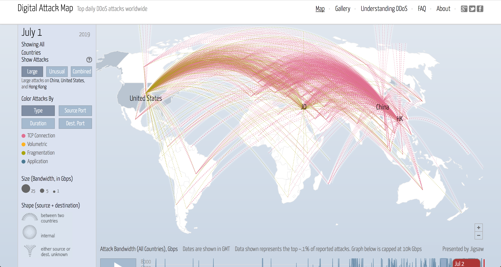

香港生活4年目のなかむ（[@nakanakamu0828](https://twitter.com/nakanakamu0828)）です。  

私は、**SE（システムエンジニア）**とか**PG（プログラマー）**とか言われているITのお仕事をしています。  
そのITに関連する情報ですが、現在香港のサイトに向けて[DDos攻撃](https://boxil.jp/mag/a2503/)というネット攻撃が進行中のようです。  
香港在住の皆さんはネットサーフィンしていて見れないサイトはありませんか？  
（日本含む香港以外のサイトを見ているから大丈夫という訳ではありません。香港にいる方はサイトによっては香港の[CDN](https://www.idcf.jp/words/cdn.html)経由で閲覧している場合がありますので見れないサイトも出てきます）

以下のサイトから香港にアタックが集中していることがわかります。  
HKに向けて赤点線がいっぱいきてますよね・・・  

http://www.digitalattackmap.com

日本の皆さんもニュースで見かけると思いますが、現在**香港**では「**逃亡犯罪人条例等改正案に反対する抗議活動**」が行われています。  
日本のメディアでデモの映像や話題を目にすることも増えたのではないでしょうか？

誰がネット攻撃をしているかはわかりません。色々な国のサーバーを踏み台にして、アクセス元がわからないようにしていることは間違いないです。  
だた、今こんなネット攻撃したらあからさまですよね・・・

こんなところまで影響してくるのかとびっくりしてしまいました・・・
