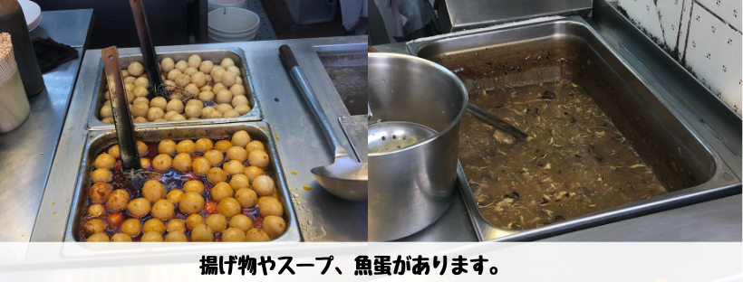
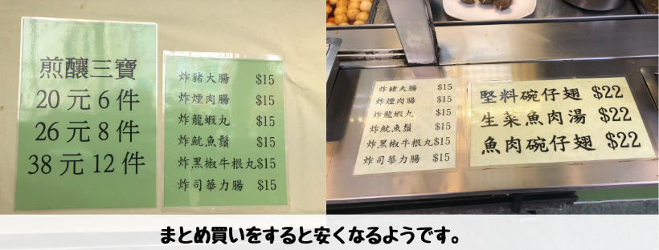
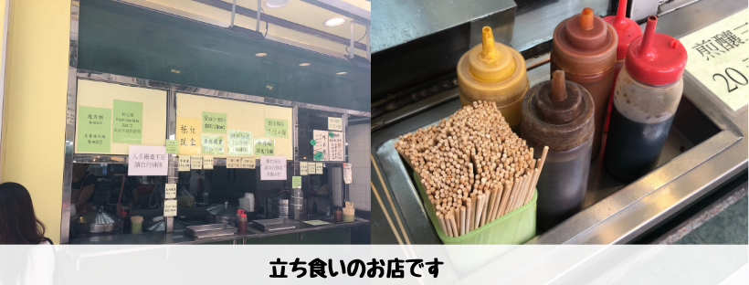

## はじめに

香港生活4年目のなかむ（[@nakanakamu0828](https://twitter.com/nakanakamu0828)）です。  

本日は、**佐敦**にあるローカルフード店でランチを食べてきました。

食べてきたのは「**魚蛋**」と「**炸猪大腸**」です。  
**魚蛋**は魚の団子でつみれのようなものです。カレー風味の辛いスープで味付けされています。  
**炸猪大腸**はホルモンの串揚げです。ここのお店では切って出してくれました。でも**炸猪大腸**は何で赤いんでしょうね 笑。いつも気になります。

## 写真（メニュー・店舗）

私はローカルフード大好きなのでまた来たいな〜、食べたいな〜と思っています。
**魚蛋**も**炸猪大腸**も私の好物なので！！

1品1品は少し高いかなと思いました。複数人でまとめ買いして安くすませるのがいいかもしれませんね！

**美食店**は立ち食いのお店です。その場で食べるか持ち帰りにしましょう〜

## 基本情報

| 項目 | 詳細 |
|:---|:---|
|  **店名**  |  美食店  |
|  **住所**  |  22 Bowring St, Yau Ma Tei  |

<iframe src="https://www.google.com/maps/embed?pb=!1m18!1m12!1m3!1d1845.6535459389634!2d114.16996905351752!3d22.30422284031993!2m3!1f0!2f0!3f0!3m2!1i1024!2i768!4f13.1!3m3!1m2!1s0x340400eb7668552d%3A0xef484fb770345963!2z576O6aOf5bqX!5e0!3m2!1sja!2shk!4v1562420696816!5m2!1sja!2shk" width="600" height="450" frameborder="0" style="border:0" allowfullscreen></iframe>

## 最後に
ローカル食や香港人のおばちゃんとのコミュニケーションにチャレンジしたい人は**美食店**に行ってみてください。  
広東語と北京語が話せる店員さんです。  
日本人にはハードル高めですが、チャレンジしてみてください。