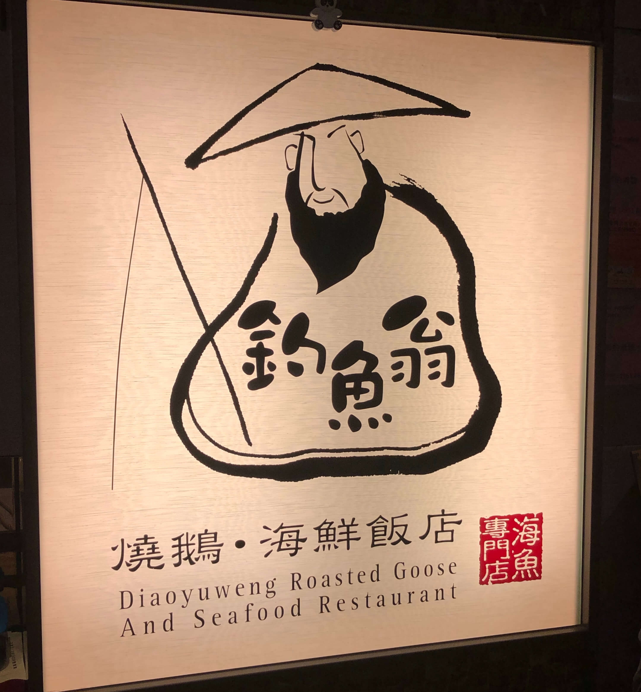
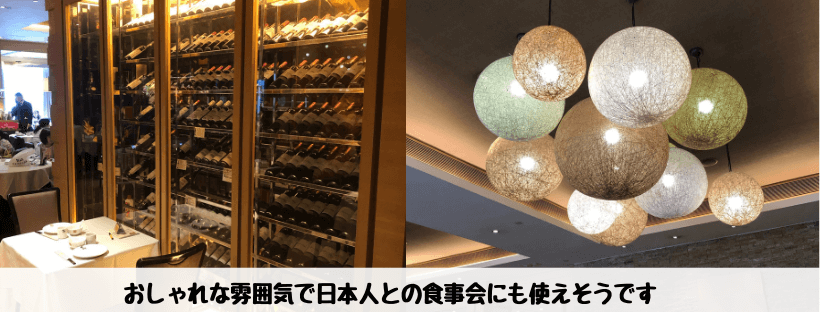
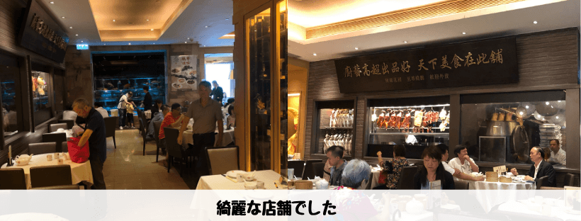
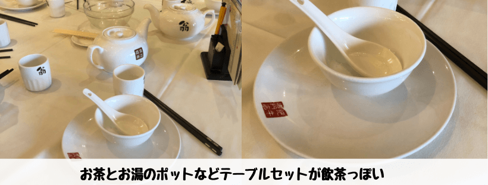
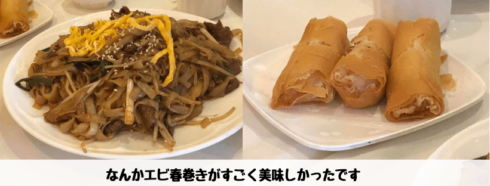
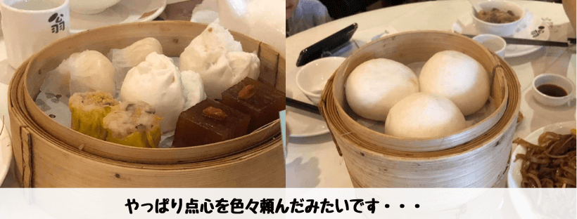
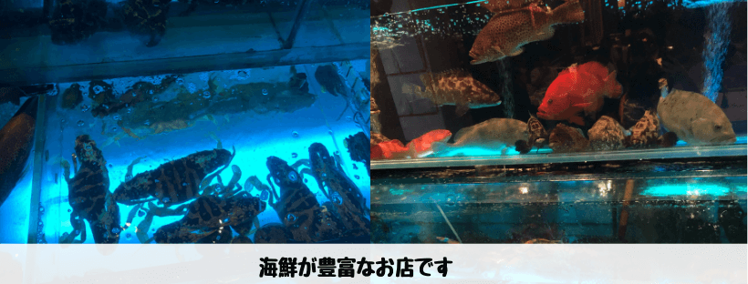
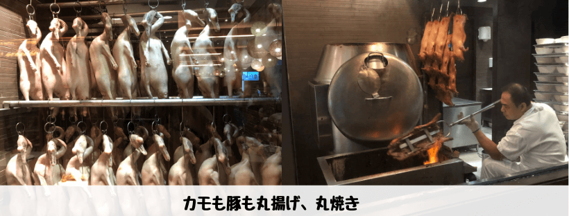
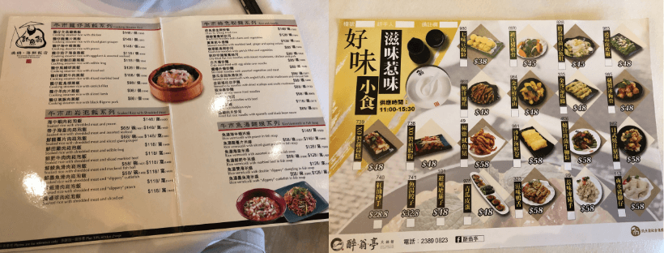
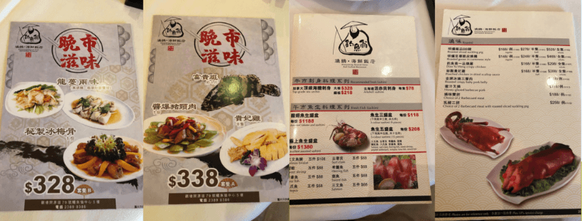

## はじめに

香港生活4年目のなかむ（[@nakanakamu0828](https://twitter.com/nakanakamu0828)）です。  

本日は、**観塘**にあるAPM近くの「**釣魚翁**」というお店で妻の友達の香港人と飲茶をして来ました。  
広東語と北京語の会話で、私は何もわからずただただ食べてました 笑

## 写真（メニュー・店舗）

エレベーターから降りてすぐワインセラーがあり、久しぶりにおしゃれな店に来たなーって思いました。  
綺麗なお店ですので、日本人の方でも入りやすいと思います。  
お昼の時間に行ったらエレベーターが激混みで、結構待たされたのがちょっと嫌でしたが

このテーブルセットを見ると飲茶に来たぞ！って実感します。  
お湯やお茶で食器を洗ってから食事にするのが飲茶です。  
熱殺菌だよって教えられたのですが・・・、あってます？？

久しぶりの点心ですがやっぱり美味しかったです。  
でも春巻きが一番私は好きでした！

生きている食材が新鮮だ！っという考え方なので、水槽から食べたい魚を選べるのがいいですよね。  

丸焼き、丸揚げ系は中々日本ではお目にかかれないので驚く方も多いのでは？

夜のメニューを一部紹介。写真を取ってきました。  
コース料理もあるようですね。やっぱり海鮮系が食べたいなーっと思いつつ、点心を頬張ってました 笑

## 基本情報

| 項目 | 詳細 |
|:---|:---|
|  **店名**  |  釣魚翁 燒鵝．海鮮飯店   |
|  **電話番号**  |  (+852) 23890386 |
|  **営業時間**  |  08:00 - 00:00 |
|  **住所**  |  觀塘開源道79號鱷魚恤中心5樓 |

<iframe src="https://www.google.com/maps/embed?pb=!1m18!1m12!1m3!1d3691.1140412089467!2d114.2236450145495!3d22.31152638531779!2m3!1f0!2f0!3f0!3m2!1i1024!2i768!4f13.1!3m3!1m2!1s0x3404014ff4f346a1%3A0x3678484719417ac1!2z6Yej6a2a57-B54S86bWd44CB5rW36a6u6aOv5bqX!5e0!3m2!1sja!2shk!4v1562487214121!5m2!1sja!2shk" width="600" height="450" frameborder="0" style="border:0" allowfullscreen></iframe>

## 参考情報
- [釣魚翁 燒鵝．海鮮飯店 - OpenRice](https://www.openrice.com/zh/hongkong/r-%E9%87%A3%E9%AD%9A%E7%BF%81-%E7%87%92%E9%B5%9D-%E6%B5%B7%E9%AE%AE%E9%A3%AF%E5%BA%97-%E8%A7%80%E5%A1%98-%E7%B2%B5%E8%8F%9C-%E5%BB%A3%E6%9D%B1-%E7%81%AB%E9%8D%8B-r112269)

## 最後に
久しぶりに飲茶をしました。  
のんびりお茶飲みながら会話を楽しむ文化は素敵だと思います。  
香港はスピード感がある街ですし、せっかちな人も多い印象です。ゆっくりできる飲茶は香港人の憩いの場なのかもしれませんね！