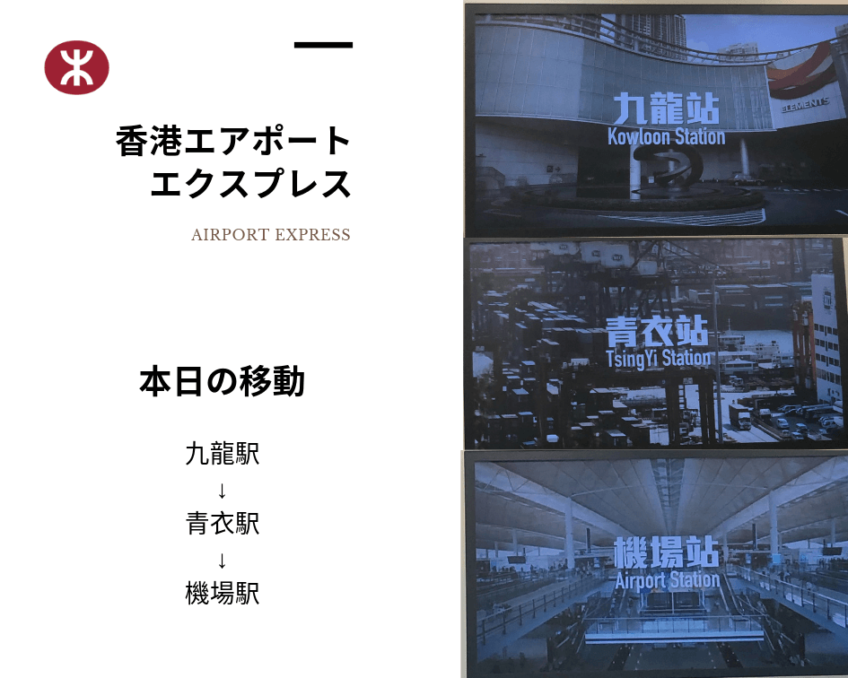
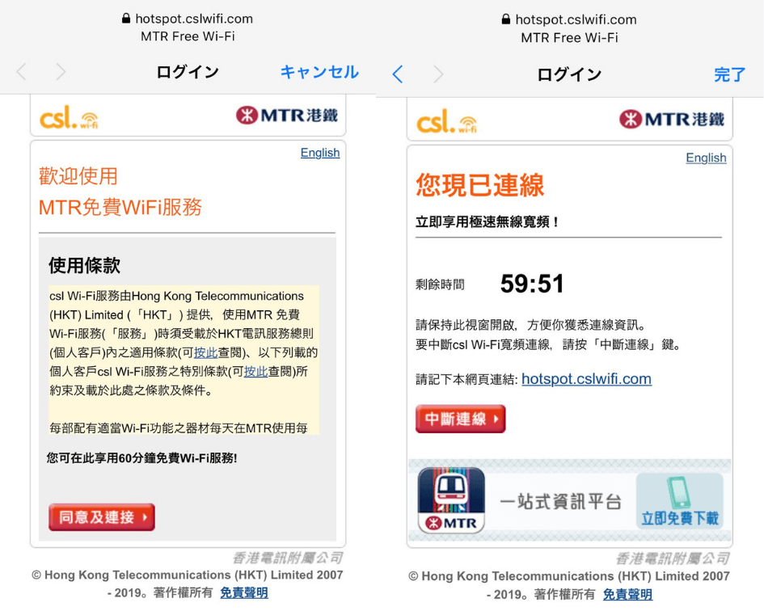

香港生活4年目のなかむ（[@nakanakamu0828](https://twitter.com/nakanakamu0828)）です。  

以前の投稿で香港国際空港に行く方法として「**香港エアポートエクスプレス**」を紹介させて頂きました。  
本日も**香港エアポートエクスプレス**に乗車したのですが、MTRのFree Wifiがあることに気付き、接続できるか試してみました。  

<embed-post-card href="/2019/06/28/airport_express/"></embed-post-card>

ちなみに今回は九龍駅から乗車しました。

それではWifiです。  
今回は、iPhoneから繋げてみました。  
Wifi設定画面にて、「**MTR Free Wifi**」を選択します。  
ログイン画面が開きますので規約に同意してください。  
（中文、英文わかる方は読みましょう。日本語でも読まない方多いと思いますが・・・）  

Wifiは１時間利用できます。１時間あれば空港まで十分利用できますね。
香港エアポートエクスプレスについては、以下のMTRのホームページもご確認ください。

[MTRホームページ](http://www.mtr.com.hk/en/customer/services/airport_express_index_tourist.html)

