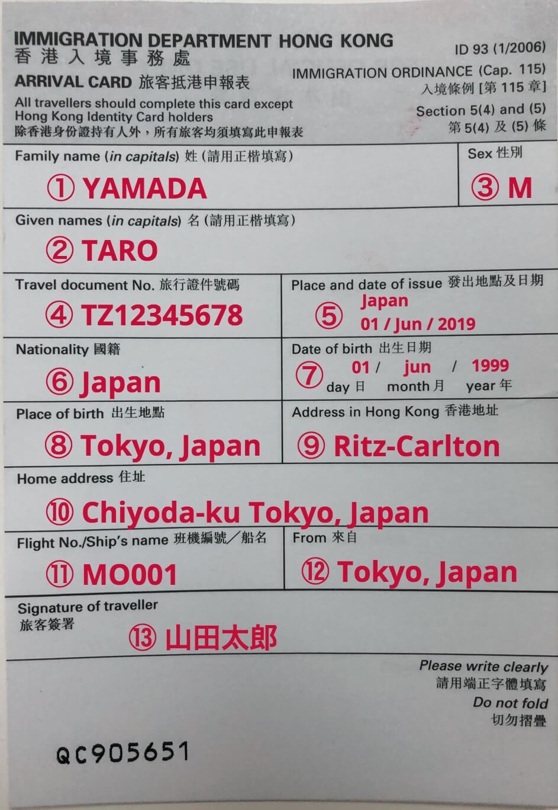
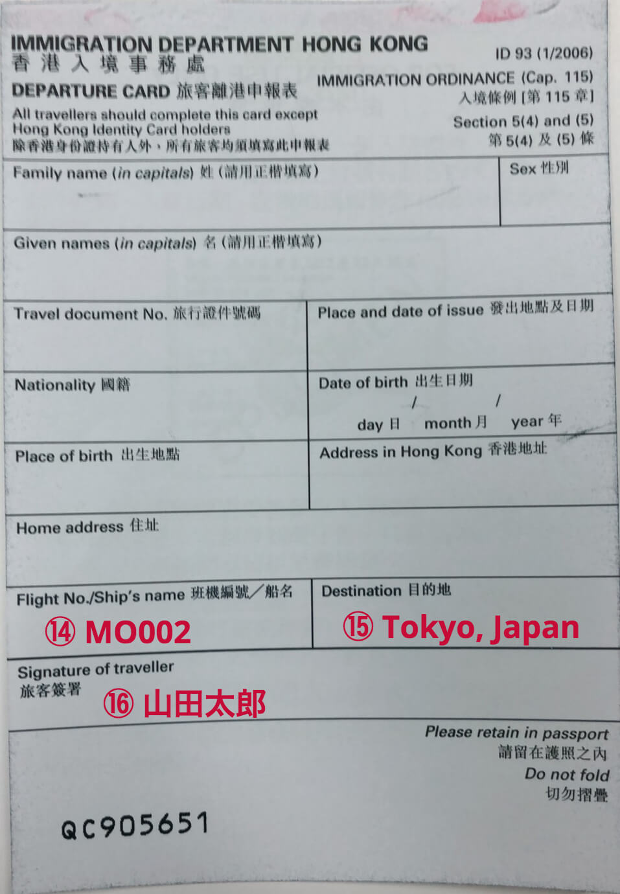

## はじめに
香港生活4年目のなかむ（[@nakanakamu0828](https://twitter.com/nakanakamu0828)）です。  

香港<-->東京の行き来をしていて、CAさんに**入出国資料**をもらったので資料の書き方を纏めたいと思います！
私は**香港ID**があるので、**入出国資料**の提出は不要でして、旅行者の皆様に向けて纏めたいと思います。

## 入国資料

① **姓**  
② **名**  
③ **性別(男性(Male)：M, 女性(Female)：F)**  
④ **パスポート番号**  
⑤ **パスポートの発行地及び発行日**  
⑥ **国籍**  
⑦ **生年月日【日・月・西暦】**  
⑧ **出生地**  
⑨ **宿泊先（ホテルなど、滞在先）**  
⑩ **住所**  
⑪ **搭乗する飛行機の便名**  
⑫ **出発地**  
⑬ **署名: パスポートと同じもの**  

## 出国資料
複写になっているので、①〜⑬までは記入が不要です。

⑭ **搭乗する飛行機の便名**  
⑮ **飛行機の目的地**  
⑯ **署名: パスポートと同じもの**  

## 最後に
海、山、島、都市がコンパクトにまとまった香港は、旅行で色々なところに行けて楽しいです。  
住むのとは異なるいいところがいっぱいです。  
是非、日本の方もさらに香港へ旅行に来て欲しいです！